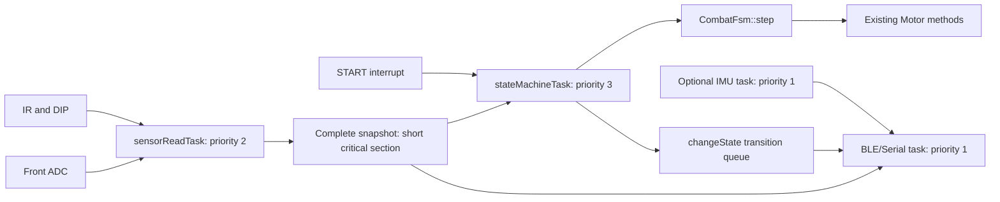

# Sensor flags and nonblocking control

## Build configuration

Edit acquisition and program choices in `include/buildConfig.h`. Each flag accepts `0` or `1`; `firmwareConfig.h` validates dependencies and supplies zero defaults for standalone/host builds.

| Flag | Enabled behavior | Disabled behavior |
| --- | --- | --- |
| `ENABLE_LINE_SENSORS=1` | Configure ADC, read both front channels and run the existing seven-sample filters | No ADC setup/read; raw snapshot values remain -1, line flags false |
| `ENABLE_IR_SENSORS=1` | Configure/read board-specific IR pins and normalize detection polarity | No IR setup/read; IR snapshot flags false |
| `ENABLE_DIP_SWITCHES=1` | Configure/read A/B/C/D/E; select opening from E/A/B/C | No DIP setup/read; use `FSM_DEFAULT_OPENING` (0 by default) |
| `ENABLE_GYRO=1` | Permit IMU initialization and DMP polling | No loggingIMU task, I2C initialization, calibration or packet reads through IMU methods |

All subsystems and task/diagnostic selectors now use numeric `ENABLE_*=0/1` switches. `#if ENABLE_*` respects explicit zero; omitting a flag also disables it. Board selectors remain `MBARETECH_1` / `MBARETECH_2`.

| Feature switch | Scope |
| --- | --- |
| `ENABLE_FSM` | Create the nonblocking combat task; requires sensor task, line and IR |
| `ENABLE_SENSOR_TASK` | Create periodic acquisition for enabled fast sensor groups |
| `ENABLE_MOTORS` | Master gate for every Motor GPIO/PWM operation, including turns and retreat |
| `ENABLE_SERIAL` | Start Serial; permit serial command input and output |
| `ENABLE_BLE` | Compile/init BLE UART and its callbacks; requires logging |
| `ENABLE_LOGGING` | Create communication/logger service, event queue and optional IMU worker; requires Serial or BLE |
| `ENABLE_DEBUG` | Additional existing diagnostic/IMU verbosity; requires Serial; does not turn logging on |
| `ENABLE_TURN_CANCEL` | Permit target-triggered cancellation of maneuver phases |
| `ENABLE_TASK_TIMING` | Collect/report task timing; requires sensor task; logging is needed to transmit records |

The four acquisition flags above remain independent. With `ENABLE_MOTORS=0`, FSM decisions and transition events still run but `Motor::begin`, `setSpeed`, `forward`, `backward` and `brake` perform no GPIO/LEDC writes. Current speed remains zero. Normal forward movement no longer has a separate `FORWARDON` gate: the same motor gate covers every maneuver.

Diagnostic selectors are `ENABLE_GYRO_TEST`, `ENABLE_MOVEMENT_TEST`, `ENABLE_MOTOR_TEST`, and `ENABLE_LINE_TEST`. `ENABLE_LEGACY_MOVEMENTS` selects the older implementation within movement tests. They are mutually exclusive with combat. Sensor-only mode simply enables the sensor task; the shared idle Arduino loop handles the foreground. `ENABLE_TURN_CALIBRATION` is rejected because that experimental module has no standalone entry point. Direct-reading diagnostics cannot run concurrently with the sensor task. Movement diagnostics require Serial and all fast sensor groups. Gyro diagnostic requires gyro + Serial and excludes logging's separate IMU owner.

Legacy `RUN_*`, `DEBUG`, `OLD`, `CANCEL_TURNS`, `FORWARDON` and `ESTADOS_ORDEN` build switches now fail with a migration diagnostic. Use buildConfig.h and the configuration combinations in [firmware.md](firmware.md), or the migration table below.

Gyro logging still requires runtime selection (menu option 4) and start (5). Its build flag permits acquisition; it does not calibrate at combat boot. The standalone `ENABLE_GYRO_TEST=1` diagnostic initializes immediately. Disabled logging channels report their build flag and remain OFF. If all fast channels are disabled, no sensorRead task is created; gyro-only logging still works.

There is one PlatformIO target. Edit `include/buildConfig.h` and always run `pio run -d Mbaretech2` from the repository root. There are no per-program environments or `-e` commands. The saved choice remains isolated gyro diagnostics.

For existing combat, disable GYRO_TEST and enable FSM, SENSOR_TASK, LINE_SENSORS, IR_SENSORS, DIP_SWITCHES, MOTORS and TURN_CANCEL. Enable SERIAL/LOGGING/BLE if needed. For a dry run set ENABLE_MOTORS=0. For gyro logging add ENABLE_GYRO=1 without enabling GYRO_TEST. For sensor-only operation leave all exclusive program selectors at 0 and enable SENSOR_TASK and the desired acquisition groups.

For a fixed opening, set ENABLE_DIP_SWITCHES=0 and FSM_DEFAULT_OPENING=4 (left 90-degree opening), for example. Valid codes are 0..15. Generic recipes use ENABLE_RECIPE_FSM and the recipe selector in the same build header; see [firmware.md](firmware.md).

## Execution and ownership



The reader calls separate `readLineSensors`, `readIrSensors` and `readDipSwitches` helpers. Each enabled filter runs exactly once per acquisition. Hardware IO happens outside the snapshot critical section. Publication and copying are atomic with respect to other tasks; the physical GPIO/ADC readings are sequential, not simultaneous. The FSM and logger get independent copies, without a growing queue of old readings.

`CombatFsm::step` has no hardware IO, sleep, serial output or maneuver wait loop. It returns signed motor percentages: positive forward, negative reverse, zero brake. Only the FSM task applies these through `Motor::forward`, `backward` and `brake`, then sleeps until its next cycle. `changeState()` records transitions without waiting on the logger. The older movement-test implementations remain separate programs.

## How the FSM works

Each call processes one bounded step:

1. **Stop/health:** inactive START, invalid data, or a snapshot older than 50 ms returns zero motor commands and resets to IDLE. START is checked again in the task before commands are applied.
2. **Opening:** leaving IDLE selects the DIP opening (or fixed build-time code) and latches snake/Turkish strategy flags. Fresh data after a stale-data stop restarts this opening if START remains active.
3. **Border priority:** either filtered line flag enters LINE_RETREAT, ahead of target detection. Repeated border samples do not restart the retreat timer.
4. **State handler:** call `stepRetreat`, `stepForward`, `stepSearch` or `stepManeuver`.

| Handler | Behavior |
| --- | --- |
| `stepRetreat` | Reverse for at least 80 ms and until both line flags clear. Then search if a front target exists, otherwise turn 180 degrees. |
| `stepForward` | Recompute close-target steering each cycle; use maximum speed when both short sensors detect; alternate timed snake outputs when selected. All motor output is controlled by `ENABLE_MOTORS`. |
| `stepSearch` | BRAKE is the search state: choose a target by center, short-left, short-right, top-left, top-right, side-left, side-right priority. Without a target, resume forward search or wait/pulse according to Turkish strategy. |
| `stepManeuver` | Obtain motor output, duration, cancellation mask and final-phase flag from `describeManeuverPhase`. Check permitted target cancellation and elapsed time without waiting. |

A compound L maneuver has three phases: left turn, 150 ms straight, right turn. R mirrors it. Short and long U maneuvers last 1000 and 2000 ms. Each phase has its own start timestamp; unsigned subtraction tolerates millis wraparound. A late cycle advances at most one phase, giving the next physical movement its full duration. Most state transitions return brake for that cycle; the newly selected state's motor command is applied on the following cycle. A compound phase change can apply its next phase immediately.

`ENABLE_TURN_CANCEL=1` enables target interruption using the phase's sensor mask; stop and border checks always apply. Unreachable/unsupported experimental enum values fall back to IDLE and brake. `SNAKE` and `TURKISH` enum names are not separate active states; they remain strategies within FORWARD/BRAKE.

## Effects of acquisition on the FSM

The installed ESP32-S3 framework uses `CONFIG_FREERTOS_HZ=1000`, so the default one-tick periods nominally mean 1 ms. This is scheduler configuration, not measured timing or a hard deadline guarantee.

| Effect | Consequence and mitigation |
| --- | --- |
| Sensor CPU time / ADC calls | Acquisition previously outranked the FSM. The FSM now has priority 3 and acquisition 2, allowing the stop/control step to preempt acquisition on a shared core. Both tasks sleep between cycles; overrun handling prevents catch-up bursts. Driver critical sections/interrupt masking can still delay the higher-priority FSM. |
| Higher control priority | Acquisition can run later under load, and the FSM may use the preceding snapshot. Control must remain bounded; increasing its work or frequency can starve acquisition. The 50 ms age check eventually brakes, but is not a freshness guarantee below 50 ms. |
| Snapshot lock | Copying a small struct briefly enters an ESP32 critical section. This can delay tasks/interrupts or spin across cores. No ADC, GPIO, filters, BLE output or I2C calls occur while holding it. Tasks are unpinned, so priority alone cannot eliminate cross-core/resource contention. |
| Sampling/filter latency | Seven consecutive line samples require roughly seven acquisition periods, then up to another control period before response, plus acquisition/scheduler jitter. At nominal 1 ms periods this is approximately 7–8 ms, not a measured worst-case bound. Changing the sensor period changes effective filtering and requires board validation. |
| Gyro calibration/I2C | Runs separately at priority 1 and is excluded by default in combat. It still consumes CPU, bus, interrupts and memory when enabled; it never holds the fast snapshot lock. Lower priority reduces direct interference but does not guarantee zero jitter. |
| Logging/radio | Formatting, Serial and BLE run outside control. They still compete for system resources. Transition queues can drop events under load; they do not block motor decisions. |
| Task/memory overhead | Separate stacks reserve 3072 bytes for acquisition and 4096 bytes for control, plus task metadata. Optional gyro adds a 4096-byte stack. Disable unused channels/tasks to reduce work; stack headroom needs on-board observation. |

Stop command response is nominally within one FSM cycle plus scheduler/API delay. It is not the robot's mechanical stopping time. A persistent border reading keeps retreat active; stale-data detection is a separate stop condition.

Tune `SENSOR_READ_PERIOD_TICKS` and `FSM_STEP_PERIOD_TICKS` only after measurement. Both must be at least one tick. Keep acquisition comfortably below the 50 ms stale threshold. Slowing the reader reduces CPU usage but adds detection latency; speeding control beyond acquisition reuses snapshots without improving sensor freshness.

## On-board timing measurement

Set `-DENABLE_TASK_TIMING=1`, start logging with menu option 5, and collect:

```text
TIMING,SENSOR,max_cycle_us,max_start_gap_us,overrun_count
TIMING,FSM,max_cycle_us,max_start_gap_us,overrun_count
```

Values are maxima/cumulative counts since boot. Cycle time measures elapsed wall time around acquisition/publication or snapshot/FSM/motor work, including interruptions; it is not exclusive CPU time and excludes reporting its own statistics. Overrun counts increment when measured cycle time reaches the configured period. Large start gaps also reveal scheduling delays that might not increment overrun counts. Timing instrumentation adds small overhead and is off by default. The communication task formats/transmits these records.

Compare identical runs with gyro disabled, enabled but idle, calibrating, and actively polling; also vary enabled channels and BLE activity. Check cycle maxima against periods, start gaps, sample-age stops and physical line response. Hardware was not available for this revision, so no measured latency or CPU utilization is claimed.

## Validation

Host control tests use real FSM code with synthetic snapshots. Sensor tests substitute GPIO/ADC and assert zero reads/filter calls for disabled groups, correct polarity/DIP order, and independent snapshots. Logging tests assert disabled channels cannot be selected and no gyro task/request is created.

```text
python Mbaretech2/test/control/run.py --suite fsm
python Mbaretech2/test/control/run.py --suite sensors
python Mbaretech2/test/control/run.py --compile-only
python Mbaretech2/test/logging/run.py --disabled
```

Device Guard may block local test executables; compilation alone does not mean their assertions ran.

Revision verification: all four provided environments and six feature variants (none, IR only, line only, DIP only, gyro only, and timing-enabled combat with fixed opening) compiled. Combat without required flags failed with the intended diagnostic. Enabled/disabled logging tests and the MBARETECH_1 FSM behavior tests passed; Device Guard blocked the MBARETECH_2 FSM and acquisition executables. Both boards' complete host test matrix compiled. No firmware was uploaded and no hardware timing was measured.

## Shared task states

`include/states.h` owns the single ordered state catalog and `State` enum. `src/core/states.cpp` owns `currentState`, `stateName()` and `changeState()`. Combat and both movement-test tasks use this interface. State names are generated from the same catalog as enum values; historical numeric IDs (0–28) remain unchanged.

A repeated state is ignored. A real change updates `currentState`, resets the legacy maneuver timer, and, when logging is enabled, calls `loggingStateChanged(previous, next)` to enqueue the transition with zero wait. With logging disabled the state path remains functional and has no telemetry queue dependency. The combat controller keeps its internal decision state and the task publishes it through this shared interface once per cycle. Legacy movement tasks keep their existing maneuver implementations; they share the enum, names and transition path, not the new combat implementation.

## Migration

| Previous switch | Replacement |
| --- | --- |
| `RUN_TASK_TEST` | `ENABLE_FSM=1` plus its sensor dependencies |
| `RUN_SENSORS_TEST` | `ENABLE_SENSOR_TASK=1` plus desired sensor groups |
| `RUN_LINE_SENSOR` | `ENABLE_LINE_SENSORS=1` |
| `RUN_GYRO_TEST` | `ENABLE_GYRO_TEST=1`, `ENABLE_GYRO=1`, `ENABLE_SERIAL=1` |
| `RUN_MOVEMENTS_TEST` / `OLD` | `ENABLE_MOVEMENT_TEST=1` / `ENABLE_LEGACY_MOVEMENTS=1` |
| `RUN_DRIVER_TEST` | `ENABLE_MOTOR_TEST=1`, `ENABLE_MOTORS=1`, `ENABLE_SERIAL=1` |
| `RUN_LS_SENSOR_TEST` | `ENABLE_LINE_TEST=1`, `ENABLE_LINE_SENSORS=1`, `ENABLE_SERIAL=1` |
| `DEBUG` | `ENABLE_DEBUG=1` and `ENABLE_SERIAL=1` |
| `CANCEL_TURNS` | `ENABLE_TURN_CANCEL=1` |
| `FORWARDON` | Removed; select `ENABLE_MOTORS=1` for all motor IO |
| `ESTADOS_ORDEN` | Removed; select `ENABLE_FSM=1` |

Additional host checks: `python Mbaretech2/test/logging/run.py --state-only` verifies the shared state IDs/names and transitions with logging disabled. `python Mbaretech2/test/hardware/run.py --motors-disabled` checks that all Motor methods leave mocked GPIO/PWM untouched.

Unified-feature verification: the six standard profiles and five compatibility profiles (BLE-only, current/legacy movement tests, motor diagnostic and line diagnostic) compiled successfully. Host tests passed for shared state names/IDs, transitions with logging disabled, motor IO suppression and logging behavior. MBARETECH_1 FSM tests passed; Device Guard blocked the MBARETECH_2 FSM executable. No firmware was uploaded.
