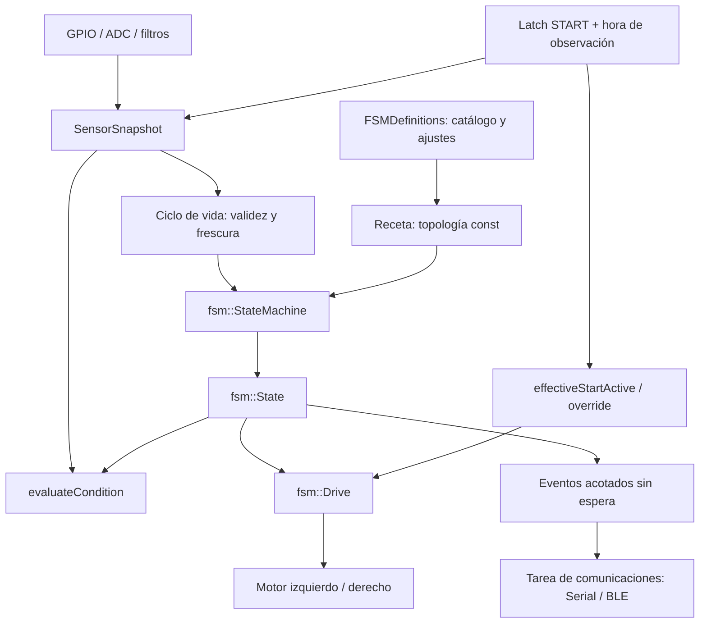
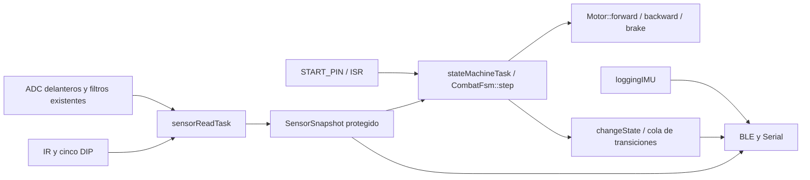

# Firmware: módulos e interfaces

Referencia de las piezas propias de `Mbaretech2`. Describe las funciones que un desarrollador necesita reconocer para cambiar el comportamiento; las bibliotecas de terceros en `lib/` conservan su propia API.

La arquitectura actual, flags de adquisición, explicación de la FSM y evaluación de interferencia entre tareas están en [control.md](control.md).

## Convenciones de mantenimiento e interfaces por recetas

El trabajo de firmware se limita a `Mbaretech2`. Mantener este `docs/firmware.md` actualizado con cada cambio de interfaces o comportamiento. Escribir código legible y comentarios que expliquen contratos, unidades, decisiones y restricciones.

El programa genérico se habilita con `ENABLE_RECIPE_FSM=1`; el combate existente conserva `ENABLE_FSM=1`. Son excluyentes. No se migró ni modificó la estrategia de `CombatFsm`. El namespace `fsm` separa el runtime genérico del enum global `State` del controlador anterior.

## Editor v31: backend actual con interfaz original

Iniciar [iniciar_editor.cmd](../iniciar_editor.cmd) en Windows: abre el editor en `http://127.0.0.1:8765/fsm_context_editor_v31.html`. El lanzador prefiere Node.js 16+ con `tools/recipe-editor/serve.cjs`; después prueba Python 3.10+ con `tools/recipe-editor/serve.py`, y finalmente usa Windows PowerShell con `tools/recipe-editor/serve.ps1`, sin instalar un runtime adicional. Comprueba el intérprete antes de usar el entorno virtual de PlatformIO: ese `python.exe` puede existir aunque falte su intérprete base. En macOS/Linux, ejecutar `sh start_editor.sh`; se necesita Node.js 16+ o Python 3.10+. La raíz se resuelve desde la ubicación del script dentro de Mbaretech2, sin elegir carpeta ni headers. No abrir directamente el HTML con `file://` para cargar firmware. Se conservan canvas, bibliotecas, inspector y edición del frontend original; el único espacio nuevo es el dock inferior opcional de Live Telemetry. Una prueba fija la huella del marcado actual sin scripts; no se carga la interfaz alternativa de `tools/recipe-editor/app.js` / `style.css`.

### Uso de los controles existentes

- **Import Firmware FSM** lee siempre las rutas fijas `include/fsm/FSMRecipeTypes.h`, `include/fsm/FSMDefinitions.h`, `include/buildConfig.h` y `include/fsm/fsm_recipe_select.h`. El listado `api/recipes` descubre todos los `fsm_recipe_*.h` de la carpeta real, incluso los no seleccionados. Repetir el botón recarga los archivos sin caché. **Alt + Import Firmware FSM**, con proyecto cargado, permite importar una receta o JSON suelto. No hay selección manual de archivos de soporte ni copias incrustadas de los headers. Si falta un archivo, se informa su ruta.
- Después de cargar el proyecto se elige una receta compatible por nombre. **Sample** permite seleccionar otra receta del proyecto. `TEST`, `TURN_CALIBRATION` y `EDITOR_TEST` usan el API actual. `COMBAT` es un placeholder explícito y se informa como «no disponible»; el combate real continúa en `CombatFsm`. Las recetas realmente incompatibles se omiten sin popup. El resumen aparece en la barra de estado y los detalles en Debug log y `FSMFirmware.diagnostics()`.
- Al importar una receta, el nombre visible de cada estado se toma de `StateMetadata.name` en `FSMDefinitions.h`; si no existe, se muestra el `StateId`. El editor mantiene el `StateId` original durante la sesión conectada para conservar las referencias de telemetría. **Export Header** genera una copia donde cada `StateId` coincide con el nombre normalizado y actualiza las referencias; también genera `FSMDefinitions.h` si hace falta. El guardado revisado y Export JSON conservan las identidades del grafo editable. Después de instalar y volver a importar ambos archivos exportados, el editor y el firmware mostrarán los nuevos IDs.
- Los nombres de estados del grafo deben ser únicos (sin distinguir mayúsculas/minúsculas) y no vacíos: el inspector rechaza un duplicado y la validación de exportación lo vuelve a comprobar. La importación también verifica que `StateId` y `ConditionId` (macros de condición) tengan nombres de metadatos únicos en sus respectivos catálogos; los IDs enum duplicados ya se rechazan. Los controles visuales de catálogo siguen remitiendo a `FSMDefinitions.h` para editar macros.
- Al importar timers de una receta C++, el editor genera una etiqueta única desde el nombre del estado, por ejemplo `MOTOR_SEQUENCE_TIMER` y `MOTOR_SEQUENCE_1_TIMER`, con sufijos si hay más de uno. El header guarda la duración o referencia de timer, pero no la etiqueta visual. Export Header conserva la duración literal salvo cuando existe un valor Live Test pendiente o aceptado para el parámetro de ese timer; en ese caso exporta ese valor como respaldo literal, sin añadir IDs falsos al firmware.
- **New** pide un nombre y crea una receta detenida válida con el primer StateId del catálogo. Se normalizan archivo, namespace y selector con `RecipeCore.normalize`.
- La biblioteca lateral contiene los StateId del proyecto y permite colocarlos repetidamente. La primera colocación usa el ID base; las siguientes reciben un sufijo libre, por ejemplo `MOTOR_SEQUENCE_1` y `MOTOR_SEQUENCE_2`. Si ya existe una instancia de esa base en el canvas, se copia su comportamiento con objetos independientes: MotionId, porcentajes, pasos, transiciones internas y salidas. Los pasos/transiciones reciben IDs gráficos nuevos; los bucles al propio estado se redirigen a la copia. Solo la instancia inicial original conserva `initial=true`. El nombre visible de cada copia usa `StateMetadata.name`, o el nuevo StateId si no hay nombre registrado.
- Las identidades nuevas se registran en una copia de trabajo de `FSMDefinitions.h`: se agregan al final de StateId antes de COUNT y a la tabla STATES, sin renumerar IDs existentes. No se redefinen enums dentro de las recetas ni se cambia el runtime. El límite continúa siendo el catálogo uint8_t y 255 estados por receta. Eliminar una instancia deja su ID disponible para otra colocación; las entradas de catálogo ya registradas no se borran automáticamente.
- Los botones originales de edición de catálogos se conservan visualmente, pero indican que los IDs deben editarse en `FSMDefinitions.h` y recargarse. No crean bibliotecas paralelas dentro del editor.
- **Export Header** valida y genera únicamente tablas del API actual, con `../FSMRecipeTypes.h`, namespace, nombre de máquina y política de finalización. En el header exportado, cada `StateId` se deriva del nombre visible del estado (mayúsculas y guiones bajos: `Forward left 45` → `FORWARD_LEFT_45`); los destinos de transición se actualizan al mismo ID. Los IDs nuevos se agregan al catálogo sin borrar los IDs anteriores que puedan usar otras recetas. Si cambia el catálogo, el modal indica `C++ Recipe Header + FSMDefinitions.h` y **Download** descarga ambos archivos. Colocar la receta en `include/fsm/recipes/` y el catálogo en `include/fsm/FSMDefinitions.h`; copiar únicamente el texto de la receta no instala sus IDs nuevos. El guardado revisado también incluye el catálogo en su lista de archivos.
- **Export JSON** guarda un documento `mbaretech-current-graph` versión 1, con geometría, etiquetas, identidad de receta y las adiciones de StateId pendientes. Al reabrirlo, esas adiciones se validan y se restauran en memoria antes de validar el grafo. **Alt + Import Firmware FSM** permite cargar ese JSON después de cargar el firmware, validándolo contra el API actual. No admite JSON ni metadatos de editores anteriores. **Export FSM Text** produce una descripción legible del modelo actual; no es otro formato de ejecución.

El backend separa `stateId` de la propiedad de movimiento y conserva el orden de aristas/pasos. Las referencias a timers y porcentajes de `FSMDefinitions.h` se conservan al importar/exportar mientras su valor no se edite en los controles. Un destino de paso eliminado queda inválido; no se convierte automáticamente en STEP_COMPLETE. La validación bloquea IDs desconocidos, duplicados, múltiples estados iniciales, destinos inválidos, comandos fuera de rango, expresiones mal contadas y finalización sin salida/retención explícita.

### Integración sin paneles nuevos

`window.FSMFirmware` expone el backend al frontend existente y a la consola del navegador:

```javascript
FSMFirmware.recipes();
FSMFirmware.select('TURN_CALIBRATION');
FSMFirmware.configure({
  ENABLE_FSM: 0,
  ENABLE_RECIPE_FSM: 1,
  ENABLE_SENSOR_TASK: 1,
  ENABLE_MOTORS: 0,
  ENABLE_SERIAL: 1,
  ENABLE_BLE: 0,
  ENABLE_LOGGING: 0,
  FSM_CONSOLE_COMPACT: 1
});
FSMFirmware.previewSave(); // Muestra rutas y contenido anterior/posterior en el modal existente.
// Después de revisar el modal:
FSMFirmware.downloadReviewed();
// Con carpeta abierta mediante FSMFirmware.open(handle):
// await FSMFirmware.saveReviewed();
```

La carga por URL es de solo lectura y no concede permiso de escritura. Para este flujo normal usar `downloadReviewed()` y colocar los archivos descargados en las rutas de la vista previa. La API `FSMFirmware.open(await showDirectoryPicker())` sigue disponible si se desea conceder acceso directo a una carpeta y usar `saveReviewed()`. El servidor solo escucha en 127.0.0.1, sirve el editor y los headers permitidos, no expone el resto del repositorio y no acepta escrituras. Se cierra con Ctrl+C. Si el puerto está ocupado, ejecutar `iniciar_editor.cmd --port OTRO_PUERTO`; `--no-browser` impide abrir la pestaña automáticamente.

`configure()` usa exclusivamente defines existentes; la vista previa comprueba dependencias conocidas antes de generar. `previewSave()` prepara el header, `buildConfig.h`, el bloque necesario de `fsm_recipe_select.h` y `FSMDefinitions.h` cuando hay nuevas instancias. `saveReviewed()` confirma la escritura, solicita permiso y verifica que originales y headers del API no hayan cambiado externamente. Las escrituras múltiples no son una transacción; si falla alguna, se enumeran las ya realizadas. No se borra ni reescribe código ajeno al selector reconocido. `active_fsm_recipe::MACHINE` permanece igual.

También están disponibles `FSMFirmware.setMotion('S1', 'FORWARD')` para la semántica de un estado básico y `FSMFirmware.setCompletionHold('S2', true)` para retención explícita de un SubFSM. Esto evita introducir controles nuevos en el diseño original. Los comandos de motores se editan con los controles existentes; MotionId no sustituye esos porcentajes.

### Archivos y verificación

- `fsm_context_editor_v31.html`: cableado de los controles y adaptación al backend, con marcado/CSS original intacto.
- `tools/recipe-editor/core.js`: parser, catálogos y exportador basados en los headers reales; rechaza identificadores de enum incompatibles.
- `tools/recipe-editor/backend.js`: conversión grafo/receta, proyecto, configuración, vista previa y escritura.
- `tools/recipe-editor/backend.test.cjs`: pruebas del grafo, referencias centrales, errores, cableado de botones con DOM simulado, huella visual y escritura con archivos simulados.

Pasaron `node Mbaretech2/tools/recipe-editor/test.cjs` y `node Mbaretech2/tools/recipe-editor/backend.test.cjs`. Un header producido mediante el botón de exportación en la prueba compiló y enlazó con el validador C++ real. Ese ejecutable no se ejecutó; las pruebas del navegador con permisos reales tampoco se realizaron. La comprobación de marcado/CSS no sustituye una prueba visual interactiva.

La carga por rutas fijas se comprobó con `node Mbaretech2/tools/recipe-editor/url.test.cjs` y `python Mbaretech2/tools/recipe-editor/serve_test.py`: headers reales, descubrimiento de recetas, falta de archivos, ausencia de caché, bloqueo de rutas ajenas y rechazo de escrituras. También pasó de nuevo la prueba del backend y conservación del marcado visual.

El lanzador se comprobó con `iniciar_editor.cmd --no-browser --port 0`: eligió Node.js aun con el Python virtual de PlatformIO roto y sirvió el HTML con HTTP 200. Con Node/Python fuera de `PATH`, eligió el servidor PowerShell, que respondió a los recursos y recetas permitidos con HTTP 200 y rechazó rutas ajenas y escrituras. `sh start_editor.sh --no-browser --port 0` inició el servidor Node desde Git Bash. La apertura del navegador en Windows usa `Start-Process` con la URL local, sin el comando `cmd start` que interpretaba incorrectamente las comillas y podía intentar abrir `\\`. Si falla la asociación de navegador, la URL impresa se puede abrir manualmente. `node Mbaretech2/tools/recipe-editor/serve.test.cjs` verifica las rutas, el listado de recetas, la ausencia de caché y el rechazo de rutas ajenas y escrituras en el servidor Node; el servidor Python se conserva como alternativa.

### Recetas existentes y compatibilidad

`fsm_recipe_test.h` usa el esquema de `FSMRecipeTypes.h`. Su ciclo actual es `IDLE → MOTOR_SEQUENCE → MOTOR_SEQUENCE_1 → MOTOR_SEQUENCE`, con intervalos de 5000, 2500 y 2500 ms y comandos 0, +100 y −100 % en ambas ruedas. Sólo la velocidad y la duración de avance son parámetros declarados; los demás campos son literales. `TEST` puede seleccionarse con `FSM_ACTIVE_RECIPE_TEST` y editarse/importarse desde el GUI.

`fsm_recipe_combat.h` sigue siendo un placeholder no compilable de la traducción genérica: el esquema actual no expresa las aperturas DIP, las negaciones de sensores ni el temporizador persistente del combate. El editor lo identifica mediante `FSM_RECIPE_UNAVAILABLE` y no lo ofrece como receta editable ni lo confunde con un archivo roto. Para combate se usa `ENABLE_FSM=1`, que conserva `CombatFsm` y sus parámetros. Seleccionar `FSM_ACTIVE_RECIPE_COMBAT` para el runtime genérico todavía produce un error de compilación deliberado.

Verificación de esta migración: pasaron las pruebas Node del parser y la carga por URL; el test de backend conservó la huella del frontend original. PlatformIO compiló la receta TEST y volvió a compilar la selección EDITOR_TEST guardada, usando siempre `[env:firmware]`; `buildConfig.h` se restauró byte por byte. Las variantes host de START y formato estructurado/compacto compilaron; dos se ejecutaron y pasaron, y Device Guard impidió ejecutar otra variante. El formateador compacto de estados se ajustó a `[FSM]` y fin de línea LF para coincidir con el formato documentado; no cambió eventos ni temporización. No se cargó firmware en hardware.

Pruebas de instancias repetidas: pasaron las pruebas Node de colocación repetida, copias independientes de SubFSM, IDs de pasos, bucles propios, eliminación/reutilización, guardado del catálogo y round-trip de JSON. El header con múltiples instancias y su catálogo ampliado compilaron y enlazaron con el validador C++ real usando una copia de pruebas bajo `.pio`; no se ejecutó ese binario ni se modificaron los headers reales del proyecto para la prueba. El test comprueba también que las recetas incompatibles no generan un popup de carga.

La selección guardada ahora es STATE_TEST. No se cargó firmware.

## Live Telemetry integrado en el editor

La telemetría canónica se habilita con `ENABLE_TELEMETRY=1` y un programa `ENABLE_RECIPE_FSM=1` o `ENABLE_FSM=1`. Requiere al menos un transporte: `ENABLE_SERIAL`, `ENABLE_BLE` o `ENABLE_WIFI_TELEMETRY`. La configuración permanece en `include/buildConfig.h` y se valida en `firmwareConfig.h`; `platformio.ini` conserva un solo target. `ENABLE_BLE` mantiene su dependencia de `ENABLE_LOGGING` para el servicio UART existente. Con `ENABLE_TELEMETRY=0`, la salida anterior de recetas y el registrador legado siguen disponibles. Con telemetría canónica activa, la emisión periódica del registrador anterior se suspende para que Serial/BLE/WiFi transporten las mismas líneas JSON; los mensajes de menús de comandos son externos al protocolo de observación.

### Captura, colas y protocolo

Los productores llaman a `telemetryPublish()` o a los helpers de `TelemetryService.h`. La adquisición publica una copia de `SensorSnapshot` y cambios de START/IR/línea; el control publica cambios de motor y estado; el observador de la receta publica las transiciones de estado y SubFSM; combate publica cambios de estado; `recordTaskTiming` publica muestras cuando está habilitado; la tarea IMU publica yaw cuando `ENABLE_GYRO=1`. START conserva su papel de permiso de ejecución y nunca se transforma en una transición de receta. Las fuentes no serializan JSON ni realizan E/S de transporte. Cada evento lleva `atUs` de `esp_timer_get_time()` tomado en el productor; `t` es su valor en milisegundos. El despachador asigna `seq` en orden de cola, antes de repartir el mismo mensaje a los tres transportes. Los IDs de estado y condición del firmware son las identidades estables; las etiquetas visuales del editor no sustituyen esos IDs. `stateIdName()` usa `STATE_ID_NAMES` para enviar el token enum incluso si se edita `StateMetadata.name`; el editor agrega ambos catálogos al crear un StateId nuevo.

`TelemetryEvent` es una estructura fija para permitir otro encoding en el futuro. El formato actual es JSON de una línea con `type`, `seq`, `t`, `us` y payload. `hello` declara `protocol:1`, `schema:2` y `machine`; se repite cada cinco segundos para terminales Serial conectadas tarde, y se emite al conectar BLE o WiFi. Los tipos son `hello`, `heartbeat`, `start_changed`, `sensors`, `ir_changed`, `line_changed`, `motor`, `fsm_status`, `fsm_transition`, `fsm_step`, `task_timing`, `stats`, `imu`, `error` y `log`. `sensors` incluye validez, tiempo de muestreo, IR1–IR7, línea filtrada, ADC y umbral. `fsm_status` comunica estado/paso, tiempos transcurridos de estado y paso, si ejecuta y la razón de bloqueo/parada; `motor` comunica la salida efectiva y su estado de origen. Las transiciones incluyen condición, duración del timer y tiempo transcurrido. En combate la condición se registra como `STATE_CHANGE` porque el controlador anterior no expone la condición de decisión. `stats` informa contadores acumulados de pérdidas por captura, Serial, BLE y WiFi. Los mensajes de error de receta pasan por el mismo servicio.

La cola de captura tiene 128 eventos; las colas independientes de Serial, BLE y WiFi tienen 32, 16 y 32 mensajes, respectivamente. El servidor WebSocket admite hasta ocho envíos pendientes. Todas las escrituras del productor son de espera cero; si una cola se llena, pierde su copia e incrementa el contador correspondiente. Un transporte lento solo satura su propia cola. Las transiciones, cambios de START/sensores y cambios de motor no se limitan deliberadamente por tasa; `sensors` y `fsm_status` se muestrean cada 100 ms, timing cada 100 ms, IMU cada 50 ms y heartbeat/estadísticas cada segundo. Los clientes detectan pérdidas de transporte mediante saltos de `seq` y pérdidas de captura con `stats`.

Serial emite una línea NDJSON por mensaje; BLE UART envía exactamente esos bytes con `\n` final, fragmentados en tramos de hasta 20 bytes para reensamblar por línea; WiFi envía el mismo JSON en frames de texto WebSocket. BLE y Serial tienen tareas de salida separadas de la tarea WiFi. Una desconexión no detiene control ni reinicia el robot. El WebSocket ignora datos entrantes: no se implementan START, motores, estados forzados, reemplazo de recetas, calibración remota, OTA ni subida de topología.

### WiFi y editor integrado

`ENABLE_WIFI_TELEMETRY=1` activa `/ws` en el ESP32. Con `WIFI_TELEMETRY_USE_STA=0` crea el AP configurado en `buildConfig.h`; la consola puede usar `ws://192.168.4.1/ws`. Con `WIFI_TELEMETRY_USE_STA=1` se conecta al SSID configurado, con espera máxima de 10 s; un fallo emite `error` por los transportes restantes. No se distribuyen credenciales privadas en archivos fuente. Para Wokwi VS Code, [wokwi.toml](../wokwi.toml) reenvía `localhost:8180` al puerto 80 simulado: compilar `firmware`, iniciar el simulador y conectar la consola a `ws://127.0.0.1:8180/ws`. La configuración guardada usa `Wokwi-GUEST`; la receta seleccionada por `FSM_ACTIVE_RECIPE_STATE_TEST` identifica su máquina como `state_test`. El probe puede comprobarla con `node tools/recipe-editor/wokwi-probe.cjs ws://127.0.0.1:8180/ws state_test`.

El botón **Open Telemetry Console** abre [telemetry_console.html](../telemetry_console.html) en una ventana con nombre fijo; pulsarlo otra vez enfoca la misma ventana. El editor conserva todo su espacio para editar recetas y resaltar el grafo. Solo la consola abre WiFi, Serial, Bluetooth o Mock. Los cuatro transportes alimentan `decodeTelemetryMessage()`, el mismo `TelemetrySession` y `TelemetryStore`; Web Serial y Web Bluetooth dependen del soporte y permisos del navegador. Mock genera el protocolo canónico con secuencia y microsegundos, incluyendo sensores, cambios de IR/línea, estados/pasos FSM, motores, timing y pérdida simulada, para probar la UI sin ESP32.

La consola usa paneles modulares en una cuadrícula adaptable. Cada panel se puede mover, ampliar a dos columnas, maximizar y colapsar; el orden y tamaño se guardan en `localStorage`, y **Reset layout** recupera los tamaños iniciales. Las vistas son Overview, Signals, FSM, Performance, Events, Terminal y Capture. La cabecera muestra conexión, máquina, versión de protocolo/esquema, uptime, RX eventos/bytes por segundo, saltos de secuencia, pérdidas y edad del último paquete. Los controles permiten detener solo el repintado, grabar, limpiar, elegir ventanas de 500 ms a 30 s y alternar densidad. **Pause UI** no detiene recepción ni captura. Los paneles muestran indicadores START/FSM/motores/snapshot, robot orientado, línea raw/umbral/filtrada, motor firmado, lógica IR/línea/START/FSM/SubFSM, series de motor/ADC/timing, línea de estados, eventos filtrables, terminal formateada o JSON y salud de transporte separada de la del control. Al elegir un evento, la inspección se centra en su marca de tiempo; la rueda sobre una gráfica cambia la ventana temporal.

La base de tiempo humana es **milisegundos de dispositivo**, con tres decimales para preservar resolución de 1 µs (`25080853 us` → `25080.853 ms`). `TelemetryStore` conserva `us` y añade `timeUs`/`timeMs` no enumerables, por lo que el JSON Raw y la captura canónica no se alteran. El campo `t` ya viene en ms y no se divide otra vez. Los ejes temporales, tablas, terminal, tooltips y duración de estados/pasos muestran ms; la ejecución y separación de tareas continúan en µs donde esa escala es más legible. Si HELLO incluye `tickPeriodMs` o un evento trae `tickCount`, la tabla deriva/muestra el tick y la fase de ciclo; con el firmware actual, que no envía ese metadato, aparece `—` sin suponer que un tick dura 1 ms.

`telemetryPresentation.js` concentra etiquetas y detalles: `FSM Transition`, `Motor Command`, `Sensor Snapshot` y demás se muestran en lenguaje legible, mientras Raw conserva el JSON original. `getStateDisplayName()` prefiere el catálogo de nombres y pasos de la receta abierta en el editor; la consola lo solicita por `BroadcastChannel`. Después usa `StateMetadata` de `FSMDefinitions.h`, el nombre recibido por telemetría y, por último, el ID formateado. La identidad estable `StateId` no cambia. Las tablas **Chronological Events** y **Unified Telemetry Terminal** tienen encabezados fijos y columnas alineadas; la primera muestra Tiempo, Δt, Tick, Tipo, Estado/Origen y Detalles. La tabla omite en Detalles el origen ya presente en su columna; el terminal mantiene la descripción completa para que cada línea se entienda por sí sola. **Key events** es el filtro inicial y deja fuera muestras periódicas; Δt puede medirse respecto al evento anterior filtrado o a un evento seleccionado como marcador A. Los eventos de transición tienen mayor énfasis visual que `FSM Status` y `Sensor Snapshot`. El inspector FSM calcula Sensor→FSM→motor con los bordes temporalmente más próximos dentro de 50 ms y lo etiqueta como correlación, no como causalidad demostrada.

Cada gráfica multiserie y cada fila del analizador lógico/línea de estados tiene controles **All**, **None**, **Reset** y selección por curva. La visibilidad se guarda en `localStorage` aparte de la ventana temporal; ocultar una curva no detiene su adquisición, historial ni grabación. Los tooltips enumeran únicamente curvas visibles y usan tiempo de dispositivo en ms.

`telemetryStore.js` mantiene un anillo de 65.536 eventos y 1.200 líneas de terminal, con contadores de sobrescritura del navegador. Las gráficas usan `us` del productor; la recepción y el almacenamiento ocurren en cada paquete, mientras el repintado está limitado a aproximadamente 20 FPS. La grabación explícita tiene un anillo propio de 250.000 eventos y muestra sus sobrescrituras. Capture permite grabar, detener, limpiar, exportar NDJSON y reproducir localmente sin enviar comandos al robot. Las prioridades/candidatos de transición, el progreso del filtro de siete muestras, RTT, ocupación de colas y overruns se indican como no disponibles cuando el protocolo actual no los publica; la UI no inventa valores.

`telemetryWindowBridge.js` usa `BroadcastChannel("mbaretech-telemetry")` entre ventanas. La consola publica HELLO, START, cambios de IR/línea, transición FSM/SubFSM, errores y cambios de estado/paso; nunca reenvía las muestras periódicas de ADC, IMU o timing al editor. Cada segundo publica un `console_status` pequeño con conexión, máquina y estado del grafo para que un editor reabierto se sincronice. Si la consola se cierra, envía desconexión; el editor también detecta la ausencia del estado periódico tras 3,5 s. El editor no abre WebSocket/BLE/Serial. El grafo resalta estado actual/anterior, paso activo, última arista y condiciones conocidas verdaderas/falsas mediante clases visuales, sin alterar el modelo editable.

`hello.machine` debe coincidir con `MachineRecipe.name` de la receta abierta. Si difiere, o aparece un StateId desconocido, el grafo en vivo se desactiva con aviso explícito y la consola continúa registrando mensajes. **Disconnect** cierra el transporte sin cambiar la receta. El historial y la exportación NDJSON permiten inspeccionar y reproducir capturas localmente; los disparos con historial previo/posterior quedan para una extensión futura. La consola admite los comandos acotados de parámetros y START descritos al final; no admite comandos motores directos ni cambios de topología.

Verificación de esta arquitectura: compilaron las selecciones de receta, combate, Serial sin WiFi, BLE y gyro opcional; se restauró `buildConfig.h` tras cada variante. Pasaron las pruebas Node de telemetría, puente entre ventanas, URL, backend/editor, servidor local y dashboard Mock/anillos/métricas; también pasó la prueba del servidor Python usando el intérprete explícito de PlatformIO. La consola se abrió en el navegador local, se conectó al transporte Mock y mostró eventos START, IR, línea, FSM y motor con tiempos y diferencias en ms; la vista Signals presentó los controles de visibilidad por curva. Los tres servidores locales (Node, Python y PowerShell) incluyen las rutas de la consola; no se ejercitó el servidor PowerShell. Wokwi emitió `hello`, `sensors`, `fsm_status`, `motor` y una transición TIMER real; el estado y destino llegaron con los tokens estables `MOTOR_SEQUENCE` y `MOTOR_SEQUENCE_1`, con `seq` y `us`. El test C++ del protocolo y del aislamiento de fan-out compiló, pero Windows Device Guard bloqueó la ejecución del `.exe`; no se eludió esa política. La suite host antigua de recetas sigue fallando porque el archivo actual `fsm_recipe_test.h` declara el namespace y los estados de TURN_CALIBRATION mientras la suite espera la receta TEST histórica. No se probó en un ESP32 físico ni se ejercitaron BLE y Serial con hardware real.
## Configuración única de compilación

`platformio.ini` contiene únicamente `[env:firmware]`, la sección que PlatformIO necesita para describir la placa y el toolchain. Ya no hay entornos de combate, sensores o recetas ni se utiliza `-e` para cambiar de programa. El único comando de compilación, desde la raíz, es:

```text
pio run -d Mbaretech2
```

Dentro de `Mbaretech2`, usar `pio run`. Para cargar, usar `pio run -t upload`; para el terminal, `pio device monitor`. El puerto se detecta como antes.

**Editar [`include/buildConfig.h`](../include/buildConfig.h)** para seleccionar placa, programa, adquisición, motores, comunicaciones y receta. PlatformIO define únicamente `MBARETECH_USE_BUILD_CONFIG=1`; `firmwareConfig.h` carga entonces el header antes de validar los switches. La inclusión normal permite detectar cambios como dependencias y recompilar las fuentes afectadas. `firmwareConfig.h` conserva comprobaciones de dependencias y defaults para compilaciones host; no es el archivo de selección cotidiana. `fsm/FSMDefinitions.h` sigue siendo el catálogo y calibración del runtime genérico, sin duplicar selección de programas.

La configuración guardada selecciona `MBARETECH_2`, receta STATE_TEST (`FSM_ACTIVE_RECIPE_STATE_TEST`), tarea de adquisición, Serial y telemetría WiFi; grupos línea/IR y logging deshabilitados. `ENABLE_MOTORS=0` y `FORCE_START_ACTIVE=0`: ensayo sin salida física. No se cambió la estrategia de combate.

Para cambiar de programa, poner primero todos los selectores exclusivos en 0, luego habilitar el elegido y sus dependencias. Los nombres de esta tabla son las partes después de `ENABLE_`; los valores indicados se ponen a 1 en el header. Los no indicados quedan a 0 salvo opciones compatibles elegidas explícitamente.

| Uso | Switches activos |
| --- | --- |
| Gyro aislado | `GYRO_TEST`, `GYRO`, `SERIAL` |
| Combate existente | `FSM`, `SENSOR_TASK`, `LINE_SENSORS`, `IR_SENSORS`, `DIP_SWITCHES`, `MOTORS`, `TURN_CANCEL`, `SERIAL`, `LOGGING`, `BLE` |
| Solo sensores | `SENSOR_TASK`, `LINE_SENSORS`, `IR_SENSORS`, `DIP_SWITCHES`, `GYRO`, `SERIAL`, `LOGGING`, `BLE` |
| Receta de motor o giro | `RECIPE_FSM`, `SENSOR_TASK`, `LINE_SENSORS`, `IR_SENSORS`, `DIP_SWITCHES`, `MOTORS`, `SERIAL`, `LOGGING` |

En el bloque de recetas de `buildConfig.h`, dejar un solo `FSM_ACTIVE_RECIPE_*` sin comentar: TEST, TURN_CALIBRATION, EDITOR_TEST o STATE_TEST. Los defines se seleccionan por presencia, no con valor 0. No combinar ENABLE_FSM y ENABLE_RECIPE_FSM. El diagnóstico antiguo ENABLE_TURN_CALIBRATION sigue sin estar soportado; el giro genérico se selecciona como receta.

Variantes sin entornos adicionales: para un ensayo sin salida física poner `ENABLE_MOTORS=0`; para agregar yaw al combate poner `ENABLE_GYRO=1` sin activar GYRO_TEST; para combate sin comunicaciones poner SERIAL/BLE/LOGGING a 0. Mantener Serial o logging en el runtime genérico para informar errores. `firmwareConfig.h` rechaza combinaciones incompatibles; `buildConfig.h` exige exactamente una placa.

Las pruebas host conservan sus flags sintéticos y no cargan automáticamente `buildConfig.h`, evitando que la selección física actual active motores o diagnósticos dentro de una prueba. Para verificar otras configuraciones reales, editar el mismo header y ejecutar el mismo comando; no crear nuevos entornos.

Verificación de la unificación: el mismo target `firmware` compiló correctamente con las configuraciones de receta de motor, receta de giro, combate existente y gyro aislado. Se restauró exactamente el header guardado después de las comprobaciones y en aquella verificación el binario final correspondía al gyro. Las dos variantes de las pruebas host de recetas también compilaron sin cargar la configuración física. No se cargó firmware en la placa.

## Runtime genérico: definiciones, condiciones y recetas

**Condición** explica por qué se activa una salida; **transición** contiene esa condición y su destino; **estado** describe el comportamiento actual; **receta** configura el grafo completo.



### Responsabilidad de cada archivo

| Archivo | Responsabilidad |
| --- | --- |
| [`FSMDefinitions.h`](../include/fsm/FSMDefinitions.h) | Configuración reutilizable, versión del esquema, IDs, nombres y descripciones de condiciones/estados. No contiene transiciones. |
| [`FSMRecipeTypes.h`](../include/fsm/FSMRecipeTypes.h) | Estructuras del esquema y enums de ejecución: comandos, expresiones, condiciones temporizadas, transiciones, pasos, estados y máquinas. |
| [`fsm_recipe_select.h`](../include/fsm/fsm_recipe_select.h) | Selección exclusiva de header en compilación; expone `active_fsm_recipe::MACHINE`. |
| `include/fsm/recipes/fsm_recipe_*.h` | Topología, orden de transiciones, comandos con dirección, destinos y secuencias SubFSM. Referencian la calibración central. |
| [`evaluateCondition.h`](../include/fsm/evaluateCondition.h) / [`evaluateCondition.cpp`](../src/control/evaluateCondition.cpp) | Mapeo de un `fsm_defs::ConditionId` a un valor semántico del snapshot. |
| [`StateMachine.h`](../include/fsm/StateMachine.h), `recipeState.cpp`, `recipeStateMachine.cpp` | Ejecución genérica, independiente de la receta seleccionada y del hardware. |
| [`RecipeLifecycle.h`](../include/fsm/RecipeLifecycle.h) / [`recipeTasks.cpp`](../src/control/recipeTasks.cpp) | Permiso de ejecución, parada/reinicio y adaptación FreeRTOS. |
| [`TransitionLog.h`](../include/fsm/TransitionLog.h), `recipeLogFormat.cpp`, `recipeLogging.cpp` | Eventos de depuración, cola acotada, formato y transporte fuera del control. |

Los headers públicos explican precondiciones y ownership. `State` conserva punteros a tablas y contexto pequeño: tiempo de entrada, paso activo, tiempo del paso y finalización. `StateMachine` contiene un único `State`. No copian tablas, asignan heap, leen GPIO/ADC ni hacen esperas durante la ejecución. Las tablas, nombres y arreglos de condiciones deben tener vida estática e inmutable, también mientras haya eventos de logging pendientes.

### Configuración central

`fsm_defs` contiene las siguientes secciones en `FSMDefinitions.h`:

- **Sistema:** `SCHEMA_VERSION=2`. El exportador debe usar la nueva expresión con conteos explícitos.
- **Runtime:** antigüedad máxima de adquisición de 50 ms, prioridad 3, pila 4096 bytes, período mediante `FSM_STEP_PERIOD_TICKS` (ticks FreeRTOS), pausa del loop auxiliar y límites de logging.
- **Motor:** límites -100..100%, velocidad de prueba 30% y velocidad de calibración de giro 40%. La receta decide el signo de cada rueda.
- **Timers:** avance de prueba 400 ms, parada 200 ms, retroceso 400 ms; giro izquierdo 350 ms, pausa 500 ms y giro derecho 350 ms. Se pueden calibrar independientemente sin editar destinos.
- **Condiciones:** `ConditionId`, `ConditionMetadata`, `CONDITIONS`, `conditionMetadata()` y `conditionName()`.
- **Estados:** `StateId`, `StateMetadata`, `STATES`, `stateMetadata()` y `stateName()`. Catálogo actual: `IDLE`, `MOTOR_SEQUENCE`, `TURN_SEQUENCE`, `DONE`; `COUNT` es un límite, no un estado válido.

Los catálogos no duplican nombres humanos en el evaluador ni en el logger. Sus búsquedas devuelven `nullptr` para IDs no registrados; los helpers de nombre devuelven un marcador desconocido. La calibración de combate sigue en sus archivos existentes y no se retoca al cambiar estos valores.

### Esquema de condiciones y seguridad de finalización

La terminología pública es `ConditionId` / `evaluateCondition()` y `TriggerType::SENSOR`. `TriggerRecipe` conserva su nombre y los miembros internos de transición siguen llamándose `trigger`; representan la condición completa de esa transición.

```cpp
struct ConditionExpression {
    const ConditionId* terms;
    uint8_t termCount;
    const LogicOp* operators;
    uint8_t operatorCount;
};
struct TriggerRecipe {
    TriggerType type;             // TIMER, SENSOR o COMPLETION
    uint32_t timerMs;             // Solo TIMER, en milisegundos
    ConditionExpression expression; // Solo SENSOR
};
```

`ConditionId` y `StateId` se definen únicamente en `fsm_defs` y se importan en `fsm`. Los demás campos de las tablas conservan sus nombres (`next_state`, `next_step`, `out_transitions`, `out_count`, etc.). `MachineRecipe` añade `const char* name`, obligatorio y no vacío para identificar eventos. `SubFsmRecipe` añade `bool allowHoldOnCompletion`: los ejemplos declaran explícitamente `false`.

Los inicializadores de la versión anterior del esquema deben actualizarse. Los structs siguen siendo agregados compatibles con C++11; no se requieren inicializadores designados de C++20 ni variables inline de C++17.

Validación exige, **antes de indexar las tablas**, `termCount >= 1` y `operatorCount == termCount - 1`. Una condición única exige cero operadores. Comprueba punteros requeridos, IDs de condiciones y valores AND/OR. Como en cualquier API con punteros C++, los arreglos físicos deben ser al menos tan largos como sus conteos; validar conteos no puede detectar un puntero inválido o una longitud física falsa.

También comprueba nombre de máquina, estado inicial, IDs registrados y únicos, destinos superiores, comandos -100..100, pasos, destinos internos y ubicación de COMPLETION. Usa búsqueda acotada del grafo interno desde el paso 0, sin recursión ni heap. Si `STEP_COMPLETE` es alcanzable y no hay salida superior COMPLETION válida, rechaza la receta salvo `allowHoldOnCompletion=true`. La alcanzabilidad es estructural y conservadora: considera todos los arcos declarados sin resolver su factibilidad temporal/lógica. Un paso de finalización desconectado del paso 0 no provoca ese error. El permiso de hold es por secuencia; no se introduce una salida ni freno implícito.

### API pública y reglas de ejecución

| API | Contrato |
| --- | --- |
| `fsm::Drive(Motor&, Motor&)` | Conserva referencias a los drivers existentes. `begin()` los inicializa, borra el comando y deshabilita movimiento. |
| `Drive::apply(const MotorCommand&)` | Retiene el comando incluso sin permiso; solo lo aplica físicamente con permiso. Convierte `left_pct/right_pct` firmados: positivo avanza, negativo retrocede, cero frena. Limita al rango central y amplía a `int` antes de negar, incluso para -128. |
| `Drive::setMotionEnabled(bool)` | false frena conservando el comando solicitado; true lo aplica inmediatamente sin transición ni nueva entrada de estado. |
| `Drive::stop()` | Frena y borra el comando solicitado; conserva el permiso. Toda salida respeta `ENABLE_MOTORS`. |
| `evaluateCondition(fsm_defs::ConditionId, const SensorSnapshot&)` | Resuelve una condición: START, IR1..IR7, línea izquierda/derecha. `NONE` es false. No evalúa AND/OR ni lee hardware. |
| `validateRecipe(const MachineRecipe&)` | Devuelve `nullptr` o el primer mensaje de error estático. Sin IO ni asignación de memoria. |
| `StateMachine(const MachineRecipe&, Drive&, TransitionObserver = nullptr)` | Conserva referencias y callback opcional; no inicia movimiento. |
| `StateMachine::begin(nowMs, RecipeErrorReporter = nullptr)` | Frena, valida y entra en el estado inicial; devuelve bool. Un error no permite ejecutar comandos de receta. |
| `StateMachine::update(snapshot, nowMs)` | Mantiene el comando y evalúa hasta una transición superior por llamada. No aplica la política de START/frescura por sí sola. |
| `StateMachine::stop()` / `isRunning()` | Detiene y desvincula el estado; otro begin reinicia la receta. `isRunning()` distingue ejecución de reposo. |
| `currentState()` / `error()` | ID activo (valor cero sin estado activo) y último error estático; begin vuelve a validar. |

`State::bind()` requiere tablas validadas y un Drive inicializado. `enter()` aplica el comando inicial y reinicia tiempos. `update()` devuelve el destino superior mediante su argumento de salida; los cambios internos de paso se resuelven dentro de State. `exit()` libera referencias sin insertar un pulso de freno entre estados. Los observadores deben ser acotados y no bloqueantes; firmware instala `enqueueTransition()`.

Las condiciones temporizadas usan resta `uint32_t` y comparación `>=`, tolerando wraparound de `millis()`. Estados MOTOR evalúan salidas en orden; gana la primera verdadera. Expresiones SENSOR se pliegan de izquierda a derecha: `A OR B AND C` equivale a `(A OR B) AND C`. `evaluateCondition()` se llama para cada término; no introduce precedencia de C++ ni negación.

Prioridad en SUBFSM:

1. Condiciones SENSOR superiores, en orden: interrumpen cualquier paso.
2. Transiciones del paso activo, en orden; como máximo una por actualización.
3. Condiciones COMPLETION superiores, en orden.
4. Temporizadores superiores, en orden.

Los temporizadores internos usan edad del paso; los superiores, edad del estado. Un cambio interno aplica el nuevo comando y reinicia el tiempo del paso a `nowMs`, incluso tras una actualización tardía. STEP_COMPLETE marca finalización, sin salida automática. Solo una secuencia que haya permitido hold puede finalizar sin salida COMPLETION; conserva su último comando y sigue evaluando salidas superiores. Ciclos de duración cero no generan bucles ilimitados.

### START y los dos dominios temporales del snapshot

**Antes del primer comando remoto, START físico conserva la política histórica de permiso de motores:** no pausa ni reinicia la FSM de recetas. `isControlDataValid(snapshot, nowMs)` comprueba `valid` y edad de adquisición <= 50 ms, con resta unsigned para tolerar rollover. Con datos sanos continúan adquisición, condiciones, transiciones, timers, SubFSM y logging aunque el pin START sea 0.

`Drive::apply()` conserva el último comando solicitado. En modo de pin físico, al caer START frena ambas ruedas conservando el comando y los tiempos del estado; al subir aplica el comando retenido. Por ejemplo, forward 400 ms → stop 200 ms → backward 400 ms → DONE termina incluso con el pin START bajo. El pin no vuelve a ejecutar una receta que ya alcanzó DONE. Los logs describen comandos solicitados, no movimiento físico.

`updateRecipeControl()` comprueba salud antes de habilitar la salida, inicia la FSM al disponer de datos sanos y la actualiza. `refreshRecipeMotorPermission()` se repite con un snapshot recién leído después de evaluar para detectar una caída de START. Datos inválidos/viejos deshabilitan salida y llaman `machine.stop()`, que borra también el comando; la recuperación comienza desde el estado inicial. En modo remoto, un comando `start_set` con `active:false` también deshabilita la salida, llama `machine.stop()` y mantiene la máquina detenida; `active:true` inicia una nueva ejecución desde el estado inicial cuando el snapshot es válido y reciente. El cambio se aplica en el siguiente ciclo de control, no es un corte PWM atómico por ISR.

**DEBUG ONLY — `FORCE_START_ACTIVE` en `include/buildConfig.h`**, validado como 0/1 en `firmwareConfig.h`: antes de un comando remoto, 0 usa START físico y 1 fuerza solamente el permiso de Drive mediante `effectiveStartActive()`. Un comando remoto tiene prioridad incluso sobre este override. No modifica ISR ni `startSignal`. Con `ENABLE_MOTORS=1` y override 1 el robot puede moverse inmediatamente después de arrancar con datos válidos; con `ENABLE_MOTORS=0` no hay escrituras GPIO/PWM de motores. La configuración guardada deja ambos switches en 0.

Las recetas normales no contienen transiciones START: IDLE usa TIMER 0 hacia la secuencia. `ConditionId::START_ACTIVE` observa el valor lógico del snapshot (físico al inicio, remoto tras el primer comando). El latch físico de la ISR no se modifica. Estas reglas corresponden al runtime genérico; `CombatFsm` conserva su política previa sin cambios.

`SensorSnapshot` es un tipo sin headers de hardware. Conserva IR normalizados en `ir[0..6]`, línea filtrada en `line[0..1]`, ADC crudo, DIP A..E y dos dominios explícitos:

| Campo | Dominio |
| --- | --- |
| `sampledAtMs`, `valid` | Adquisición publicada de línea/IR/DIP. GPIO y ADC se leen secuencialmente; no implican simultaneidad física. |
| `startActive`, `startObservedAtMs` | START lógico observado al recuperar el snapshot (pin físico o override remoto), y `millis()` inmediatamente después. |

Se conserva la lectura inmediata de START para no retrasar la parada hasta la siguiente adquisición. `readSensorSnapshot()` copia la publicación bajo sección crítica, luego lee el latch y su hora; no vuelve a adquirir GPIO/ADC. Por eso START puede ser más reciente que los sensores, y su hora no sustituye `sampledAtMs` en el chequeo de frescura. Una copia anterior no se actualiza por otro consumidor. No es una instantánea eléctrica simultánea ni una parada atómica con PWM. DIP conserva su interpretación y ausencia de debounce actuales.

### Verificación del permiso START

PlatformIO compiló `ENABLE_RECIPE_FSM=1` con motores habilitados y `FORCE_START_ACTIVE=0` y `1`, usando el único target `firmware`. También compiló la configuración final restaurada: MOTOR_TEST, `ENABLE_MOTORS=0`, `FORCE_START_ACTIVE=0`. No se cargó firmware ni se verificó hardware físico.

`python Mbaretech2/test/recipes/run.py --compile-only` compiló ocho variantes: ambas recetas con cada override y el driver Motor real con cada combinación de motores/override. Las pruebas agregadas cubren avance de SubFSM, condiciones y eventos con START bajo, reanudación inmediata del comando retenido sin transición, freno sin reinicio de timers, DONE sin rearranque, recuperación por salud y ausencia de pulso con muestra vieja. Los sustitutos GPIO/LEDC comprueban duty/dirección y ausencia de toda escritura con motores deshabilitados. Windows Device Guard bloqueó la ejecución del primer binario host: las aserciones nuevas están compiladas pero no verificadas por ejecución. No se intentó eludir esa política.

### Logging genérico

La depuración no depende del enum ESTADO legado ni de activar el menú de registro. `fsm_defs::runtime::TRANSITION_LOGGING` la habilita; se puede desactivar en la configuración central. Se registra cada transición superior e interna, incluyendo STEP_COMPLETE, sin mensajes repetidos por mantener un estado. Inicio/parada del ciclo de vida no se presentan como transiciones inventadas.

El selector `FSM_CONSOLE_COMPACT` de `include/buildConfig.h` se valida como 0/1 en `firmwareConfig.h`. El build guardado usa 1; las compilaciones host sin selección explícita conservan 0. Solo cambia la presentación final de `formatTransition()`: no cambia eventos, timestamps, orden, cola, timers, condiciones, START ni comandos.

**Formato estructurado (`FSM_CONSOLE_COMPACT=0`)**: `formatStructuredTransition()` conserva exactamente el formato anterior, incluidos separadores, campos y salto de línea. Ejemplo de evento de paso:

```text
FSM,TURN_CALIBRATION,AT_MS=350,SCOPE=STEP,STATE=TURN_SEQUENCE,CONDITION=TIMER,DETAIL=350_ms,ELAPSED_MS=350,NEXT=TURN_SEQUENCE,MOTOR_L=-40,MOTOR_R=40,STEP=0,NEXT_STEP=1
```

Incluye máquina, hora, ámbito, estado actual, tipo de condición, nombres de condiciones o temporizador, destino, tiempo transcurrido, comando de origen y paso. Expresiones SENSOR muestran sus nombres/operadores en orden; su semántica sigue siendo el plegado de izquierda a derecha. En eventos STEP, NEXT_STEP=-1 significa STEP_COMPLETE; en STATE significa salida superior. STEP=-1 identifica un estado básico. El tiempo es del paso para transiciones internas y del estado para salidas superiores.

**Consola compacta (`FSM_CONSOLE_COMPACT=1`)**: `formatCompactTransition()` muestra una línea por evento, con nombres del catálogo y timestamp original en ms (ancho mínimo 4, sin recortar números mayores):

```text
[FSM]    80 | IDLE -> MOTOR_SEQUENCE | TIMER 0ms
[STEP]  480 | MOTOR_SEQUENCE 0->1 | 400ms | L=30 R=30
[STEP]  680 | MOTOR_SEQUENCE 1->2 | 200ms | L=0 R=0
[STEP] 1080 | MOTOR_SEQUENCE 2->END | 400ms | L=-30 R=-30
[FSM]  1080 | MOTOR_SEQUENCE -> DONE | COMPLETE
```

STATE usa `[FSM]` y `origen -> destino`; STEP usa `[STEP]`, estado y `paso->destino`. `NEXT_STEP=-1` se presenta como `END`. TIMER muestra su duración configurada (no sustituye timestamps ni modifica tiempos), COMPLETION muestra `COMPLETE`, y SENSOR muestra nombres unidos por ` AND ` / ` OR `, en el orden de evaluación de izquierda a derecha. Por ejemplo:

```text
[FSM]   520 | IDLE -> MOTOR_SEQUENCE | IR3_DETECTED OR IR4_DETECTED
[STEP]  730 | TURN_SEQUENCE 1->2 | LINE_LEFT_DETECTED | L=-40 R=40
```

Esta sección describe la salida anterior cuando `ENABLE_TELEMETRY=0`; con telemetría canónica activa, los tres transportes emiten NDJSON y `FSM_CONSOLE_COMPACT` no cambia ese protocolo. Solo STEP incluye `L`/`R`: son el comando solicitado del paso de origen, no la velocidad física ni el comando del paso destino. El formato compacto omite máquina, elapsed y campos redundantes; para analizadores que requieren esos datos usar 0. Ambos formatos conservan buffers fijos, `snprintf` y retorno false por truncación/error, sin asignaciones dinámicas en el formateador. Si se habilita logging/BLE sin telemetría canónica, el mismo formato seleccionado llega al transporte existente. Mensajes `FSM_LOG_TRUNCATED`, `FSM_LOG_DROPPED` y `FSM_RECIPE_ERROR` conservan su formato en esa ruta anterior.

Configuración recomendada para Wokwi/depuración por Serial, editando el mismo `buildConfig.h` y compilando con `pio run`:

```cpp
#define ENABLE_RECIPE_FSM         1
#define ENABLE_MOTORS             0
#define ENABLE_SENSOR_TASK        1
#define ENABLE_SERIAL             1
#define ENABLE_BLE                0
#define ENABLE_LOGGING            0
#define ENABLE_DEBUG              0
#define ENABLE_TASK_TIMING        0
#define ENABLE_TELEMETRY          0
#define FSM_CONSOLE_COMPACT       1
```

Mantener los otros programas exclusivos desactivados y seleccionar los grupos de sensores necesarios para la receta. Con logging desactivado el loop Arduino sigue drenando eventos hacia Serial. El cambio de presentación no habilita movimiento.

Verificación de consola: ambos valores compilaron en PlatformIO para el único target `firmware`; se restauró la configuración guardada con compacto 1 y motores 0. Pasaron las pruebas host de ambas recetas con ambos formatos y START override 0, incluidas comparaciones exactas de TIMER/SENSOR/COMPLETION, STATE/STEP/END, límites/truncación y ausencia de nuevas asignaciones. Las ocho variantes de runtime (dos recetas × dos formatos × dos overrides) y cuatro variantes del driver compilaron. Device Guard bloqueó el test separado de driver con motores habilitados, por lo que la ejecución completa de esa matriz no terminó; no se eludió la política. No se cargó firmware.

Con `ENABLE_TELEMETRY=0`, el control solo copia eventos a una cola estática protegida de 32 posiciones, sin espera ni heap. Si está llena descarta el evento nuevo y cuenta pérdidas. Comunicaciones drena como máximo cuatro por vuelta y usa el `sendData()` existente para Serial/BLE; cuando solo hay Serial sin servicio de logging, el loop Arduino drena la misma cola. Siempre hay un solo consumidor. Formato/String/transporte quedan fuera de la tarea de control. Se informa `FSM_LOG_DROPPED,cantidad`; las líneas/expresiones demasiado largas generan `FSM_LOG_TRUNCATED` y un marcador cuando corresponde. BLE conserva su fragmentación y entrega no garantizada. Estos eventos son independientes del canal ESTADO del menú legado.

Una receta inválida deja motores detenidos y termina la tarea. Con telemetría canónica emite `error` en los tres transportes; sin ella conserva `FSM_RECIPE_ERROR,mensaje` por el mecanismo anterior. Los mensajes de error pertenecen a la ruta de arranque/fallo.

### Recetas, compilación y combate

Seleccionar exactamente un define por presencia en `fsm_recipe_select.h`:

| Define | Comportamiento |
| --- | --- |
| `FSM_ACTIVE_RECIPE_TEST` | Avance 30%/400 ms, parada 200 ms, retroceso 30%/400 ms y DONE. |
| `FSM_ACTIVE_RECIPE_TURN_CALIBRATION` | Giro izquierdo 40%/350 ms, parada 500 ms, giro derecho 40%/350 ms y DONE. |
| `FSM_ACTIVE_RECIPE_COMBAT` | Error explícito: aún no hay traducción fiel del combate. |

Ambos ejemplos conservan interrupt de borde a DONE y no se repiten hasta reiniciar el ciclo de vida. Las duraciones no garantizan ángulos reales sin calibración en placa. La selección sigue siendo de fuente/build, no de DIP, GUI o BLE en ejecución. La selección ENABLE_FSM continúa utilizando CombatFsm.

Bloqueos de migración de combate: 16 aperturas por DIP, condiciones negativas, velocidades y duraciones dinámicas, fases snake persistentes, timer Turkish que sobrevive cambios de estado y ciclos de freno/transición existentes. Esta limpieza no los aproxima ni añade una estrategia nueva.

```text
pio run -d Mbaretech2
python Mbaretech2/test/recipes/run.py
python Mbaretech2/test/recipes/run.py --compile-only
python Mbaretech2/test/control/run.py --compile-only
```

El programa genérico requiere ENABLE_SENSOR_TASK y Serial o logging para errores. Elegir la receta en buildConfig.h; ENABLE_MOTORS=0 excluye IO de motores. No se cargó firmware en una placa.

### Verificación de esta limpieza

Las dos variantes de las pruebas host pasaron después de implementar condiciones, validación de conteos/finalización, logging y lifecycle, incluida la comprobación de ausencia de asignaciones de heap. Tras ajustar inicializadores para C++11, Device Guard bloqueó la repetición del binario; la compilación host final pasó para ambas recetas y para las pruebas existentes de control/adquisición de ambos modelos, incluidas las variantes de canales y START-only. La compilación PlatformIO estuvo inicialmente bloqueada por el servicio de revisión de permisos. Posteriormente, durante la unificación de configuración, se verificó este código en las dos recetas, combate existente y gyro utilizando el único target `firmware`, como se detalla arriba. No se eludieron controles de permisos ni Device Guard.

## Arranque y estado compartido

En `src/main.cpp` se crean `leftMotor` y `rightMotor`, los arreglos de sensores y los manejadores de tareas. `include/globals.h` declara los pines, `enum Sensor`, la inclusión de `states.h`, las velocidades y los tiempos. `src/core/globals.cpp` inicializa `parametros[19]`.

- `setup()` configura BLE, IR, ADC de línea, DIP y pin de arranque. Crea `stateMachineTask()` cuando `ENABLE_FSM=1` o `ENABLE_MOVEMENT_TEST=1`. `RUN_MOVEMENT_SENSOR_CALIBRATION` se rechaza con un error de compilación explícito porque no está implementado. En combate, `setup()` inicializa y frena los motores antes de crear las tareas; los modos antiguos de movimientos los inicializan en su propia tarea.
- `KS_ISR()` copia el nivel de `START_PIN` a `startSignal` en ambos flancos de la interrupción. La variable es `volatile` porque se comparte con la tarea.
- `elapsedTime(TickType_t duration)` devuelve `true` cuando transcurre la duración desde la primera llamada de la secuencia. Recibe **ticks FreeRTOS**, usa un único temporizador estático y lo reinicia cuando devuelve `true`. `changeState()` lo reinicia al cambiar de estado para que una maniobra interrumpida no deje tiempo acumulado. Se conserva para las pruebas antiguas de movimientos; el nuevo combate usa marcas de tiempo propias en milisegundos y no llama a `elapsedTime()`.
- Se eliminó el stub sin uso `checkSensors()`, que devolvía una variable sin inicializar.

`currentState` publica las transiciones mediante `changeState()`. En combate y prueba de sensores, `SensorSnapshot` sustituye los arreglos globales como fuente de lecturas. Los arreglos `irSensor`, `lineSensor` y `dipSwitch` quedan para las rutas antiguas de diagnóstico y movimientos; no deben consultarse para el nuevo combate.

En la implementación activa, los `case` principales se agrupan en espera y búsqueda (`IDLE`, `BRAKE`, `FORWARD`), evasión del borde (`LINE_RETREAT`), giros (`TURN_LEFT_45`, `TURN_RIGHT_45`, `TURN_LEFT_90`, `TURN_RIGHT_90`, `TURN_180`), correcciones cortas y maniobras compuestas (`SHORT_LEFT_MOVE`, `SHORT_RIGHT_MOVE`, `L_MOVEMENT_45`, `R_MOVEMENT_45`, `GIRO_U_*`). `MOVEMENT_45` conserva su giro izquierdo de 90 grados. Los estados experimentales `_IF`, `BACKWARD`, `TURN_RIGHT` e `INITIAL_MOVEMENT` no tienen una apertura ni transición en el nuevo controlador; cualquier estado no soportado produce freno y `IDLE`. `SNAKE` y `TURKISH` son nombres del enum, pero la ruta activa los utiliza como indicadores booleanos, no como estados con un `case` propio.

## Clase `Motor`

Definida en `include/motor.h`; hay una instancia por rueda. Encapsula dos pines de dirección y un canal PWM LEDC.

- `Motor(pwmPin, A0pin, A1pin, pwmChannel)` guarda los pines y el canal que utilizará la instancia.
- `begin()` configura los GPIO como salidas y prepara el temporizador y el canal LEDC a 20 kHz y 10 bits. Debe ejecutarse antes de ordenar movimiento.
- `setSpeed(percentage)` convierte un porcentaje a duty LEDC y lo limita al intervalo 0–990. El valor 0 produce duty 0; porcentajes mayores de 100 se limitan antes de convertir. No modifica los pines de dirección.
- `forward(speed)` y `backward(speed)` fijan direcciones opuestas y llaman a `setSpeed()`.
- `brake()` pone ambas entradas de dirección en bajo. Pone el duty en cero; el efecto mecánico exacto depende del controlador de motores, cuyo modelo sigue pendiente.

`currentSpeed` conserva el duty solicitado (0–990), y `ledc_channel` conserva la configuración enviada al controlador, incluido el duty actualizado. No son una medición de velocidad física ni una confirmación de ejecución del hardware.

## Sensores de línea

Las funciones están implementadas en `src/sensors/lineSensor.cpp` y requieren `ENABLE_LINE_SENSORS=1` para configurar o leer ADC; sin ese flag, las funciones de lectura devuelven -1.

- `lineSensorsInit()` configura resolución y atenuación de los dos canales ADC1 delanteros. También configura la atenuación de los canales traseros ADC2.
- `readLineSensorFront(channel)` devuelve una lectura ADC1 sin filtrarla.
- `checkLineSensora(measurement)` y `checkLineSensorb(measurement)` mantienen contadores independientes para izquierda y derecha. Devuelven `true` tras siete lecturas consecutivas menores o iguales a `THRESHOLD`; una lectura mayor reinicia su contador. Los contadores saturan en siete, por lo que la detección permanece activa sin desbordarse mientras siga la condición.
- `readLineSensorBack(channel)` intenta leer ADC2 y devuelve `-1` si falla. No participa en el combate y los canales traseros se inicializan junto con los delanteros.

El combate usa `SensorSnapshot::line[0]` y `line[1]` para los sensores delanteros. El arreglo global antiguo tiene cuatro posiciones; las dos traseras no participan en combate.

## Comunicación BLE y registro de datos

`include/bluetoothComm.h` declara la interfaz; `src/communication/bluetoothComm.cpp` implementa el UART BLE con los mismos UUID RX/TX y nombre `MBARETECH`. RX recibe **un comando por escritura** (máximo 63 bytes, con CR/LF opcional). Sus callbacks encolan comandos sin esperar; la tarea `communications` los procesa y transmite. La cola admite 16 comandos; un exceso se descarta. Suscribirse a TX y enviar cualquier tecla (también Enter) abre el menú; `menu` y `registro` siguen disponibles. `ayuda` recuerda los comandos. El saludo de conexión puede preceder a la suscripción.

El protocolo existente `ÍNDICE VALOR` funciona dentro y fuera del menú, incluso durante la entrada de intervalo. Ahora valida índices 0–18. Los valores conservan su semántica previa. No se implementaron menús de parámetros ni de calibración.

```text
=== REGISTRO DE DATOS ===
Estado: DETENIDO
Intervalo: 100 ms
1. Sensores de línea [OFF]
2. Sensores IR [OFF]
3. Máquina de estados [OFF]
4. Yaw IMU [OFF]
5. Iniciar registro
6. Detener registro
7. Cambiar intervalo
0. Volver
```

1–4 alternan canales independientemente, también durante el registro. 5 inicia y muestra canales e intervalo; 6 detiene sin reiniciar el firmware. 7 solicita un entero entre **20 y 60000 ms**, o 0 para cancelar. La entrada inválida mantiene el intervalo previo. El valor inicial es **100 ms**, todos los canales OFF y registro detenido. Fuera del menú, la primera tecla solo lo abre, sin ejecutar la opción numérica. Dentro del menú, las opciones válidas conservan su acción y cualquier otra tecla vuelve a mostrarlo. La entrada de intervalo y los comandos `ÍNDICE VALOR` conservan su interpretación. 0 sale del menú sin detener el registro; para detenerlo, volver con `menu` y enviar 6. La desconexión detiene el registro, conserva canales/intervalo y reinicia publicidad BLE.

### Formatos y origen de datos

Cada registro termina en LF. TX fragmenta el flujo en notificaciones de hasta 20 bytes para admitir el MTU predeterminado. El cliente debe concatenar bytes antes de separar líneas o decodificar UTF-8. Las respuestas del menú comparten el flujo: filtrar por los prefijos siguientes para análisis.

| Canal | Formato exacto | Origen |
| --- | --- | --- |
| Línea | `LINEA,tiempo_ms,left,right` | Últimos ADC delanteros sin filtrar, publicados por `readLineSensorFront()`; no incluye sensores traseros. -1 indica que aún no hubo lectura. |
| IR | `IR,tiempo_ms,SIDE_LEFT,SHORT_LEFT,TOP_LEFT,TOP_MID,TOP_RIGHT,SHORT_RIGHT,SIDE_RIGHT` | Siete valores 0/1 del snapshot (arreglo `irSensor[]` en modos antiguos), en orden de `enum Sensor`; 1 significa detección normalizada por el control. |
| Yaw | `YAW,tiempo_ms,yaw_grados` | `IMU::currentAngle`, calculado por el `getYaw()` existente a partir del cuaternión DMP; convertido a entero por el registro; `currentAngle` conserva precisión flotante. |
| Transición | `ESTADO,tiempo_ms,ANTERIOR->NUEVO` | Nombres reales de `enum State`, por ejemplo `IDLE->FORWARD`. |
| Pérdidas de eventos | `PERDIDOS,ESTADO,cantidad` | Transiciones descartadas por cola llena desde el informe anterior. |

El orden IR de MBARETECH_2 corresponde a IR1, IR2, IR3, IR4, IR5, IR6, IR7. Para MBARETECH_1 se omiten los laterales inexistentes: SHORT_LEFT, TOP_LEFT, TOP_MID, TOP_RIGHT, SHORT_RIGHT (IR2–IR6). La compilación verificada en esta iteración es MBARETECH_2.

Línea, IR y yaw son **periódicos**, con tiempo de emisión `millis()` y comparación por resta sin signo que tolera su desbordamiento. En combate y prueba de sensores, línea e IR provienen de una copia del mismo snapshot; la adquisición sigue activa durante cada maniobra. Los GPIO y ADC se leen secuencialmente, no simultáneamente. Los modos antiguos de movimientos todavía pueden publicar lecturas antiguas por sus esperas bloqueantes. No se agregan lecturas ADC/GPIO ni filtros al módulo Bluetooth. No se recuperan períodos atrasados en ráfagas.

Las transiciones son **eventos**: `changeState()` conserva la asignación de estado y, si cambió efectivamente, encola tiempo de transición, estado anterior y nuevo con espera cero. Las asignaciones en `tasks.cpp`, `movements.cpp` y `movements_old.cpp` pasan por ese punto, incluso dentro de maniobras bloqueantes. No se imprime un estado repetido ni un estado inicial artificial al iniciar. La cola tiene 64 posiciones; cada activación utiliza una sesión para descartar eventos antiguos después de detener/reiniciar o alternar el canal. La tarea BLE drena hasta ocho eventos por vuelta. El transporte BLE y su congestión nunca esperan dentro de la tarea de control.

### IMU y arquitectura del registro

`include/dataLogging.h` y `src/communication/dataLogging.cpp` contienen `LoggingConfig`, menú de registro, temporización, caché de línea y cola de transiciones. Solo la tarea BLE modifica configuración/menú; valores compartidos con productores usan atómicos y la cola FreeRTOS. La tarea BLE duerme 5 ms entre vueltas; estas pausas pertenecen a esa tarea, no al control.

Solo con `ENABLE_GYRO=1` se crea la tarea separada `loggingIMU`, que consulta el DMP cada 10 ms mientras yaw está seleccionado y el registro activo. Inicializa la clase IMU existente en el primer uso, sin cambiar el arranque del combate. **Mantener el robot inmóvil durante esta inicialización**, porque `IMU::begin()` ya incluye calibración. No es un nuevo menú de calibración. Esta operación puede tardar, pero no bloquea comandos BLE ni la FSM. `IMU.h` expone disponibilidad del DMP y del paquete recién leído; no agrega otra fórmula de orientación.

Se emite `YAW,tiempo_ms,NA` mientras inicia, si falla la IMU, si aún no existe una muestra o si la última supera 500 ms de antigüedad. Una inicialización fallida no se repite continuamente: revisar hardware y enviar 5 para reintentar, o desactivar/activar yaw. No habilitar ENABLE_GYRO_TEST: el registro ya tiene su propia tarea IMU. Al detener, cesa el sondeo de yaw; el DMP permanece habilitado. Notificaciones BLE no tienen entrega garantizada; intervalos pequeños y muchos cambios pueden saturar la salida. El registro es de desarrollo, con tiempos aproximados sujetos al planificador y al enlace.

`parametros` se usa principalmente en `src/diagnostics/movements.cpp`, no como fuente de los ajustes principales de `src/control/tasks.cpp`. Sus índices se agrupan así: 0–1 para comando y movimiento de prueba; 2 para velocidad de avance; 3–11 para velocidades y duraciones de giros y movimientos cortos; 12 para umbral; 13–17 para estrategia `turkish` y giros en U; 18 para compensación de velocidad. Los valores iniciales están en `src/core/globals.cpp`.

### Verificación

- Compilar: `pio run -d Mbaretech2` desde la raíz.
- Pruebas de comportamiento en Windows con Python y MSVC Build Tools: `python Mbaretech2/test/logging/run.py`. Compilan el módulo de registro real con sustitutos de hardware/FreeRTOS; cubren menú, selección simultánea, intervalos inválidos, desbordamiento de millis, inicio/parada, desconexión, transiciones breves, cola llena y yaw no disponible/antiguo.
- Validación pendiente en placa: suscribirse a TX, enviar `menu`, activar 1–4 y enviar 5; comprobar ADC izquierdo/derecho, cada IR en orden y yaw girando el robot después de calibrar. Cambiar intervalo con 7, detener con 6, reiniciar y desconectar/reconectar. Verificar `0 0` como comando de parámetros y rechazo de índice 19.
- Confirmar en placa que las notificaciones fragmentadas se reconstruyen, que la cadencia y las pérdidas son aceptables y que motores/FSM conservan su comportamiento. Las pruebas host no simulan radio, DMP ni temporización física.

## Clase `IMU` y rutas alternativas

`include/IMU.h` envuelve un MPU6050 por I²C. El registro de yaw la instancia en su tarea dedicada y la inicia bajo demanda; `src/main.cpp` no la inicia durante el arranque.

- `begin()` inicia I²C en SDA 15 y SCL 16, configura y calibra el MPU6050 y habilita su DMP si la inicialización funciona. Informa del resultado por `Serial`.
- `getData()` lee un paquete disponible del DMP y actualiza orientación y `currentAngle`.
- `transmitData()` imprime yaw, pitch y roll por `Serial`.
- `checkRotation(desiredAngle)` compara `currentAngle` con un ángulo inicial estático y devuelve `true` al alcanzar la diferencia solicitada. Este método no controla ningún motor por sí mismo.
- `getYaw(data, q)` calcula el ángulo usado por `getData()`.

`src/diagnostics/movements.cpp` define otra `stateMachineTask()` para ensayar maniobras con `parametros`; se compila únicamente con `ENABLE_MOVEMENT_TEST`. `src/diagnostics/movements_old.cpp` guarda una versión anterior y requiere además `ENABLE_LEGACY_MOVEMENTS=1`. Los programas de `src/diagnostics/` son rutas de diagnóstico independientes, no pruebas unitarias automáticas. Sus condiciones de uso están en [desarrollo.md](desarrollo.md).

## Funciones declaradas sin ruta activa

Se eliminaron la declaración sin implementación `lineSensorTask()` y su manejador sin uso. `changeState()` ahora se define en `src/core/states.cpp` como punto de asignación y registro de transiciones. También declara pines de encoder sin lectura asociada. Los nombres de `State` incluyen opciones que la máquina activa no implementa; su ruta no soportada devuelve velocidades cero y vuelve a `IDLE`.


## Modo de prueba de sensores sin FSM

La configuración de solo sensores usa `MBARETECH_2`, `ENABLE_SENSOR_TASK` y flags explícitos `ENABLE_LINE_SENSORS=1`, `ENABLE_IR_SENSORS=1`, `ENABLE_DIP_SWITCHES=1`, `ENABLE_GYRO=1`. No combinar con otros modos que definan `loop()`.

`sensorReadTask()` actualiza IR, los cinco DIP y ambos ADC delanteros cada tick. Aplica una vez por adquisición `checkLineSensora()`/`checkLineSensorb()`. `src/diagnostics/sensorsTest.cpp` solo cede CPU en `loop()`. La cadencia de adquisición es independiente del intervalo de salida BLE (100 ms por defecto).

Este modo no crea la tarea de combate ni emite comandos de motor. BLE y la tarea de yaw siguen disponibles: enviar `menu`, activar los canales deseados y enviar 5. No habrá registros ESTADO porque no se ejecuta la FSM. La verificación de detección física y yaw requiere la placa.


## Depuración por cable

Con `ENABLE_SERIAL=1`, `Serial` se inicia a **115200 baudios**, antes de BLE, sin requerir `ENABLE_DEBUG` ni esperar a que se abra un terminal. `sendData()` duplica menús, respuestas y registros en Serial y en BLE cuando hay conexión.

El terminal serie también acepta los mismos comandos: enviar texto seguido de Enter (LF, CR o CRLF). Enter solo abre o muestra el menú. La entrada es incremental y no espera una línea completa; admite 63 bytes y rechaza líneas más largas hasta el siguiente terminador. El menú y configuración son compartidos entre ambos transportes.

Para probar sin BLE: abrir el monitor a 115200, pulsar Enter, enviar 1/2/4 según los canales deseados y 5 para iniciar. No es necesario conectar un cliente BLE. Si se desconecta un cliente BLE durante el registro, se conserva la parada automática existente; enviar 5 desde el menú serie para reanudar. Las impresiones propias de IMU o ENABLE_DEBUG también pueden aparecer en Serial; filtrar prefijos para analizar registros. La salida serie se realiza en la tarea de comunicaciones, no en la FSM.

### Diagnóstico de yaw no disponible

Además de YAW,...,NA, se emite una línea IMU cuando cambia el estado: ESPERANDO_INICIO, CALIBRANDO, LISTA, SIN_PAQUETES_RECIENTES_DMP, ERROR_TAREA, ERROR_BUS_I2C, NO_DETECTADA o ERROR_DMP,codigo. Los mensajes llegan por Serial y BLE. NO_DETECTADA corresponde al chequeo del MPU6050 en 0x68 con SDA=15/SCL=16; comprobar conexión, alimentación y dirección AD0. ERROR_DMP conserva el código devuelto por la biblioteca. Tras inicializar el DMP se limpia FIFO. Los diagnósticos permiten distinguir fallo de conexión, calibración y falta de muestras; no implican que el hardware haya sido verificado.

## Prueba aislada IMU por Serial

`src/diagnostics/gyroTest.cpp` usa únicamente métodos existentes de IMU.h: begin(), isReady(), getInitError(), getData() y hasYaw(), junto con currentAngle. Activar `ENABLE_GYRO_TEST=1`, `ENABLE_SERIAL=1` y `ENABLE_GYRO=1` en `include/buildConfig.h`, dejando los otros programas y ENABLE_LOGGING en 0. No inicia BLE ni la FSM.

Abrir Serial a 115200 y mantener el sensor inmóvil durante la calibración. La prueba consulta el DMP cada 10 ms e imprime muestras válidas hasta cada 100 ms como `YAW,tiempo_ms,grados`. Si falla begin(), informa el error (-2: bus; -3: MPU6050 no detectado; otros negativos: fallo DMP). Corregir y reiniciar. Si no hay paquetes recientes durante un segundo, informa SIN_PAQUETES_RECIENTES_DMP en lugar de imprimir un ángulo antiguo.

Se eliminaron las funciones adicionales de diagnóstico: este modo ya no escanea direcciones ni imprime ejes crudos. Usa la configuración existente de IMU.h (SDA 15, SCL 16, dirección predeterminada 0x68).

Para volver al registro normal, desactivar ENABLE_GYRO_TEST y restaurar MBARETECH_2, ENABLE_LINE_SENSORS y ENABLE_SENSOR_TASK.

### Corrección de getYaw()

getYaw() usa atan2(2(xy-wz), w²+x²-y²-z²), equivalente a la fórmula anterior para un cuaternión unitario e independiente de una escala común no nula. Conserva signo y grados; `currentAngle` es flotante. gyroTest.cpp imprime currentAngle en el formato `YAW,tiempo_ms,grados` para verificar esta ruta; pitch/roll continúan usando ypr. La conversión de cuaterniones y ypr[0] de la biblioteca no se modificaron.

## Correcciones y verificación de esta revisión

Se restauraron los hooks de adquisición de línea y transiciones, el inicio Serial controlado por `ENABLE_SERIAL` y la inicialización IMU bajo demanda. `bluetoothComm.h` contiene solo declaraciones: la implementación duplicada anterior impedía compilar los modos BLE. Los modos de prueba excluyentes producen un error al combinarse; `ENABLE_LEGACY_MOVEMENTS=1` selecciona únicamente la implementación antigua de movimientos.

La configuración guardada en `include/buildConfig.h` es la receta STATE_TEST sin motores físicos. Las pruebas host de registro se ejecutan con `python Mbaretech2/test/logging/run.py`. `python Mbaretech2/test/hardware/run.py` compila los módulos reales de motor y línea con sustitutos para comprobar duty cero, límites, freno, detección sostenida y publicación ADC; Windows Device Guard bloqueó la ejecución de este nuevo binario y la repetición final del binario de registro. Una ejecución anterior de las pruebas de registro pasó. Se verificaron compilaciones de gyro, sensores, combate y ambas rutas de movimientos para MBARETECH_2. La validación física de motores, ADC, radio y DMP sigue pendiente.

## Arquitectura de tareas y FSM no bloqueante



- `include/sensorSnapshot.h` define el snapshot y `include/sensorTasks.h` define el servicio y períodos; `src/sensors/sensorTasks.cpp` es el único lector de ADC/IR/DIP en estos modos. Conserva la polaridad MBARETECH_1 (IR2/3/5/6 activos altos, IR4 activo bajo) y MBARETECH_2 (todos activos bajos). Los laterales inexistentes de MBARETECH_1 quedan falsos.
- Adquisición: prioridad 2, pila 3072 bytes y período de un tick. Se publica una copia completa bajo una sección crítica corta; la adquisición, filtros y logging quedan fuera del bloqueo. Los consumidores reciben copias independientes. No hay cola creciente de muestras atrasadas. Los contadores de línea avanzan una vez por muestra, con latencia aproximada de siete períodos.
- Control: prioridad 3, pila 4096 bytes y período de un tick. `CombatFsm::step(snapshot, started, nowMs)` calcula un comando acotado sin IO, esperas, impresión ni bucles de maniobra. `tasks.cpp` aplica porcentajes con los métodos existentes de `Motor` y publica cambios mediante `changeState()`. Ambas tareas ceden CPU con `vTaskDelayUntil()`; ante atraso reprograman sin recuperar períodos en ráfaga. Las prioridades no equivalen a una garantía física de tiempo real.
- Inicialización: ADC/GPIO y motores antes de las tareas. Si no puede crearse adquisición, no se crea control. Si no puede crearse control, los motores quedan frenados. Un snapshot no publicado, inválido o mayor de 50 ms (`SENSOR_MAX_AGE_MS`) fuerza `IDLE` y freno. Cada ciclo revisa START, incluso durante maniobras; vuelve a comprobarlo antes de aplicar el comando. Al reanudar con START activo y datos válidos se reinicia la apertura DIP.
- Apertura: conserva los 16 códigos E/A/B/C; D se publica, pero no selecciona estrategia. Se conservan velocidades, tiempos de giro, retroceso mínimo de 80 ms, giros U de 1000/2000 ms y la secuencia giro/avance 150 ms/contragiro de L/R. Cada fase guarda su propio inicio en milisegundos y tolera el desbordamiento de `millis()`.
- Cambios intencionales: borde tiene prioridad sobre todos los objetivos y maniobras; el retroceso no reinicia su tiempo con cada muestra y continúa mientras detecta borde. `ENABLE_TURN_CANCEL=1` conserva la transición al objetivo detectado. Las correcciones durante avance se recalculan con cada snapshot. Snake y el pulso Turkish son fases temporizadas, interrumpibles por parada o borde. `ENABLE_MOTORS=1` habilita todos los comandos de motor. Los antiguos `FORWARDON` y `ESTADOS_ORDEN` se rechazan; consultar la migración en control.md.
- `ENABLE_MOVEMENT_TEST`, con o sin `ENABLE_LEGACY_MOVEMENTS=1`, conserva las pruebas anteriores y sus esperas. No se ejecuta junto con el nuevo combate. IMU permanece en su tarea existente, porque la calibración es bloqueante.

Seleccionar combate o solo sensores en `include/buildConfig.h` y compilar con `pio run -d Mbaretech2`. La configuración guardada es STATE_TEST sin motores físicos; no se cargó firmware en una placa.

Pruebas del controlador: `python Mbaretech2/test/control/run.py`. Compilan el código real y cubren ambos modelos, 16 aperturas, parada en fases distintas, datos inválidos/antiguos, prioridad de borde, cancelación por objetivo, secuencias L/R, Turkish, snake y desbordamiento temporal. También incluyen publicación de snapshot, polaridad, orden DIP y fallo de creación de tarea con sustitutos de hardware. Las pruebas de controlador pasaron para ambos modelos; Windows Device Guard bloqueó la ejecución de la prueba adicional de adquisición. Los resultados host no verifican temporización, señal eléctrica ni dinámica física del robot.

Verificación de compilación de la arquitectura: combate MBARETECH_1 y MBARETECH_2, sensores, gyro y ambas variantes de movimientos completaron correctamente. `--compile-only` permite compilar todas las pruebas host de control/adquisición sin ejecutar binarios.

Los flags ENABLE_* prevalecen sobre las descripciones históricas de activación por modo: todos son opt-in y se documentan en [control.md](control.md). Los menús no pueden habilitar canales excluidos de compilación.

## Enablers y estados compartidos

La configuración de habilitación se edita en `include/buildConfig.h`: todos los switches `ENABLE_*` aceptan 0/1. `include/firmwareConfig.h` valida dependencias y conserva fallback 0 para flags omitidos en compilaciones host. `ENABLE_LOGGING`, `ENABLE_BLE` y `ENABLE_SERIAL` controlan servicio y transportes independientemente; `ENABLE_MOTORS` controla todos los métodos GPIO/PWM de Motor. `include/states.h` conserva IDs y nombres de State en un único catálogo. Las tareas del controlador de combate existente y diagnósticos publican sus transiciones mediante `changeState()` en `src/core/states.cpp`; este llama al hook opcional `loggingStateChanged()` cuando está habilitado el registro. Consultar [control.md](control.md) para perfiles y migración.

## Motor and sensor API reference

This reference describes the current **Mbaretech2** C++ interfaces. For architecture and build profiles, see [control.md](control.md); communication and logging are documented above.

### Build configuration and ownership

Edit feature switches in [`buildConfig.h`](../include/buildConfig.h); [`firmwareConfig.h`](../include/firmwareConfig.h) validates their dependencies and supplies zero defaults for standalone/host builds. Each accepts `0` or `1`. Select exactly one board with `MBARETECH_1` or `MBARETECH_2`.

| Switch | Effect |
| --- | --- |
| `ENABLE_MOTORS` | Enables motor GPIO and PWM writes. |
| `ENABLE_SENSOR_TASK` | Compiles the snapshot acquisition service. |
| `ENABLE_LINE_SENSORS` | Enables line ADC initialization and readings. |
| `ENABLE_IR_SENSORS` | Enables IR GPIO acquisition. |
| `ENABLE_DIP_SWITCHES` | Enables DIP GPIO acquisition. |
| `ENABLE_GYRO` | Enables MPU6050 initialization and DMP acquisition. |
| `ENABLE_TASK_TIMING` | Exposes acquisition/control timing diagnostics; requires the sensor task. |

`setup()` in [`main.cpp`](../src/main.cpp) initializes enabled ADC and input GPIO before starting acquisition. `startSensorTask()` does not configure those peripherals. Motor initialization is performed by the selected control/diagnostic mode. The combat FSM requires the sensor task, line sensors, and IR sensors; motor output still requires `ENABLE_MOTORS=1`.

Use one owner for motor commands and one owner for IMU acquisition. These classes do not provide locking. In snapshot modes, the sensor task owns line/IR/DIP acquisition; consumers call `readSensorSnapshot()` instead of reading hardware or advancing filters themselves. Direct-reading movement/line diagnostics cannot be combined with the sensor task.

### Motor interface

Header and implementation: [`motor.h`](../include/motor.h).

```cpp
Motor(uint8_t pwmPin, uint8_t A0pin, uint8_t A1pin,
      ledc_channel_t pwmChannel);
void begin();
void setSpeed(uint32_t percentage);
void forward(uint32_t speed);
void backward(uint32_t speed);
void brake();
```

| API | Contract |
| --- | --- |
| Constructor | Stores pin/channel assignments; performs no hardware initialization. |
| `begin()` | Configures output pins and LEDC low-speed timer 0 at 20 kHz, 10-bit resolution; configures the channel and calls `brake()`. Call before commanding movement. |
| `setSpeed(percentage)` | Accepts an unsigned percentage, clamps values above 100, maps 0–100 to integer duty 0–1023, then caps duty at 990. Updates PWM without changing direction pins. |
| `forward(speed)` | Sets A0 low, A1 high, then applies `setSpeed(speed)`. |
| `backward(speed)` | Sets A0 high, A1 low, then applies `setSpeed(speed)`. |
| `brake()` | Sets duty to zero, then sets both direction pins low. Mechanical braking/coasting depends on the driver. |

All methods return `void`; LEDC errors are not propagated. With `ENABLE_MOTORS=0`, these methods perform no hardware writes and set `currentSpeed` to zero. Do not pass negative speed values: conversion to `uint32_t` can turn them into a large positive value, which is then clamped to 100. Direction is selected by the method, not by the speed sign.

Public `currentSpeed` is the last requested PWM duty (0–990), not a percentage, RPM, or feedback measurement. `ledc_channel` stores the channel configuration, including the updated duty when enabled. Pin/channel fields are also public; configure them through the constructor rather than changing them during operation. Both motors share LEDC timer 0.

#### Existing motor instances

`globals.h` declares `extern Motor leftMotor` and `rightMotor`; `main.cpp` constructs them as follows. The direction pins are reversed for MBARETECH_1.

| Board | Motor | PWM GPIO | A0 GPIO | A1 GPIO | LEDC channel |
| --- | --- | --- | --- | --- | --- |
| MBARETECH_2 | Left | 35 | 36 | 37 | 1 |
| MBARETECH_2 | Right | 48 | 47 | 20 | 0 |
| MBARETECH_1 | Left | 35 | 37 | 36 | 1 |
| MBARETECH_1 | Right | 48 | 20 | 47 | 0 |

Example calls from the task that owns motor output, after initialization:

```cpp
#include "globals.h"

void driveForward(uint32_t percent) {
    leftMotor.forward(percent);
    rightMotor.forward(percent);
}

void stopDrive() {
    leftMotor.brake();
    rightMotor.brake();
}
```

### Sensor snapshot interface

Data type: [`sensorSnapshot.h`](../include/sensorSnapshot.h), independent of hardware headers. Service declarations: [`sensorTasks.h`](../include/sensorTasks.h). Implementation: [`sensorTasks.cpp`](../src/sensors/sensorTasks.cpp). Service definitions are compiled only with `ENABLE_SENSOR_TASK=1`.

```cpp
enum DipIndex { DIP_A, DIP_B, DIP_C, DIP_D, DIP_E };

struct SensorSnapshot {
    int rawLine[2] = {-1, -1};
    bool line[2] = {};
    bool ir[7] = {};
    bool dip[5] = {};
    bool startActive = false;
    uint32_t startObservedAtMs = 0;
    uint32_t sampledAtMs = 0;
    bool valid = false;
};

bool startSensorTask();
void sensorReadTask(void* parameter);
SensorSnapshot readSensorSnapshot();
```

| API | Contract |
| --- | --- |
| `startSensorTask()` | Creates `sensorRead` with stack size 3072 and priority 2. Returns `false` if task creation fails; returns `true` if created or already running. If line, IR, DIP, and the recipe runtime are all disabled, returns `true` without creating a task. Recipe modes still publish acquisition timestamps when no physical channels are enabled. Call during startup after configuring enabled peripherals. |
| `sensorReadTask(parameter)` | FreeRTOS entry point; ignores its argument and loops indefinitely. Reads enabled channels, applies line filters once per acquisition, and publishes a complete snapshot. Normally started through `startSensorTask()`, not called directly. |
| `readSensorSnapshot()` | Copies the latest published snapshot under a short critical section, then refreshes logical `startActive` from the ISR latch or remote command. Does not trigger acquisition or wait for a new sample. Before first publication, acquisition fields retain their defaults but START still reflects the selected source. |

Acquisition runs every `SENSOR_PERIOD_TICKS`, an alias of `SENSOR_READ_PERIOD_TICKS` (default **1 FreeRTOS tick**, not necessarily 1 ms). After an overrun it yields a full period instead of catching up in a burst. GPIO and ADC reads occur sequentially; a consistent published copy does not imply simultaneous physical sampling.

| Field | Meaning |
| --- | --- |
| `rawLine[0]`, `rawLine[1]` | Front-left/front-right raw ADC counts; `-1` before acquisition or when line acquisition is disabled. |
| `line[0]`, `line[1]` | Filtered front-left/front-right edge detections. `true` after seven consecutive readings at or below `THRESHOLD`. |
| `ir[7]` | Normalized opponent detections; `true` means detected. Index using `Sensor` below. |
| `dip[5]` | Raw digital levels in A, B, C, D, E order; no polarity inversion or debounce. Index using `DipIndex`. |
| `startActive`, `startObservedAtMs`, `startRemoteControlled` | Logical START at retrieval, its observation time in milliseconds, and whether a remote command currently owns it; a separate domain from acquisition timestamp/validity. No additional GPIO read. |
| `sampledAtMs` | `millis()` captured after acquisition, in milliseconds. |
| `valid` | Set on publication; when line acquisition is enabled, requires both raw line readings to be nonnegative. Does not verify IR/DIP connectivity, freshness, or whether every channel is enabled. |

Disabled boolean channels remain `false`. A snapshot can be valid with line acquisition disabled. If no task was created, it stays unpublished/invalid.

The combat controller rejects invalid or older-than-50-ms snapshots (`SENSOR_MAX_AGE_MS`) and brakes. Other consumers must check freshness themselves using unsigned subtraction to tolerate `millis()` wraparound:

```cpp
#include "sensorTasks.h"

bool frontOpponentDetected() {
    const SensorSnapshot sample = readSensorSnapshot();
    const uint32_t nowMs = millis();
    if (!sample.valid ||
        uint32_t(nowMs - sample.sampledAtMs) > SENSOR_MAX_AGE_MS) {
        return false;
    }
    return sample.ir[TOP_MID];
}
```

This example requires IR acquisition and a started sensor task. IMU yaw is not a snapshot field. START is exposed as `startActive`. Legacy `irSensor`, `lineSensor`, and `dipSwitch` arrays are not the data source for the snapshot service.

#### IR and DIP mapping

`Sensor` is declared in [`globals.h`](../include/globals.h). Snapshot indices remain fixed across board versions.

| Index / name | MBARETECH_2 GPIO | MBARETECH_1 GPIO | Active level |
| --- | --- | --- | --- |
| 0 / `SIDE_LEFT` | 39 | Absent | Low on board 2; always false on board 1 |
| 1 / `SHORT_LEFT` | 40 | 7 | Low on board 2; high on board 1 |
| 2 / `TOP_LEFT` | 38 | 4 | Low on board 2; high on board 1 |
| 3 / `TOP_MID` | 4 | 17 | Low on both |
| 4 / `TOP_RIGHT` | 5 | 40 | Low on board 2; high on board 1 |
| 5 / `SHORT_RIGHT` | 18 | 6 | Low on board 2; high on board 1 |
| 6 / `SIDE_RIGHT` | 17 | Absent | Low on board 2; always false on board 1 |

DIP A/B/C/D/E use GPIO 42/2/1/44/19 respectively. Setup uses `INPUT` for IR and DIP pins. The combat opening uses E/A/B/C; D is still acquired.

### Low-level line sensor interface

Declarations: [`globals.h`](../include/globals.h). Implementation: [`lineSensor.cpp`](../src/sensors/lineSensor.cpp).

```cpp
void lineSensorsInit();
int readLineSensorFront(adc1_channel_t channel);
int readLineSensorBack(adc2_channel_t channel);
bool checkLineSensora(int measurement);
bool checkLineSensorb(int measurement);
```

| API | Contract |
| --- | --- |
| `lineSensorsInit()` | Configures ADC1 for 12-bit reads and sets `ADC_ATTEN_DB_12` on front ADC1 channels 2/7 and rear ADC2 channels 8/9. No-op when line acquisition is disabled. |
| `readLineSensorFront(channel)` | Returns `adc1_get_raw(channel)` unchanged; successful 12-bit readings are raw counts 0–4095. With logging enabled, also publishes the reading through `loggingLineSample()`. Returns `-1` when line acquisition is disabled. |
| `readLineSensorBack(channel)` | Returns ADC2 raw counts on `ESP_OK`, otherwise `-1`; also returns `-1` when disabled. Rear readings are not included in the snapshot or combat control. |
| `checkLineSensora(measurement)` | Advances the static left filter counter. Returns true at seven consecutive samples `<= THRESHOLD`; a value above the threshold resets it immediately. |
| `checkLineSensorb(measurement)` | Same behavior with an independent right filter counter. |

Use `LINE_FRONT_LEFT` / `LINE_FRONT_RIGHT` for ADC1 and `LINE_BACK_LEFT` / `LINE_BACK_RIGHT` for ADC2. Initialize before direct reads. `THRESHOLD` is 145 for MBARETECH_2 and 169 for MBARETECH_1; these are ADC counts, not volts.

Filter counters saturate at seven and have no explicit reset API. They are shared across all callers of each function and are not synchronized. The filter functions remain active regardless of the acquisition flag and do not reject negative measurements: `-1` also satisfies `<= THRESHOLD`. Direct-reading callers must reject failed reads before filtering. The snapshot service separately marks negative line samples invalid.

### IMU interface

Header and implementation: [`IMU.h`](../include/IMU.h). The class wraps an MPU6050 at its default I2C address (0x68), using SDA GPIO 15, SCL GPIO 16, and a 400 kHz bus.

```cpp
void begin();
bool isReady() const;
int getInitError() const;
bool getData();
bool hasYaw() const;
void transmitData();
bool checkRotation(int desiredAngle);
void getYaw(float* yawDeg, Quaternion* q);
```

| API | Contract |
| --- | --- |
| `begin()` | Resets readiness flags, initializes I2C and MPU6050, applies configured offsets/ranges, calibrates accelerometer and gyro, enables the DMP, and resets FIFO on success. Blocking: keep the robot stationary and run outside time-sensitive control. Returns no status; inspect `isReady()` and `getInitError()`. |
| `isReady()` | Reports successful DMP initialization, not whether a fresh sample exists. |
| `getInitError()` | Returns the initialization result listed below. Initial value is zero even before `begin()`, so check readiness as well. |
| `getData()` | Returns true when a DMP packet was obtained and orientation updated. Otherwise returns false and, in enabled builds, clears `yawAvailable`. It does not reset the stored angle on failure. With gyro disabled, returns false without acquiring. |
| `hasYaw()` | Reports `yawAvailable`, indicating success of the most recent enabled `getData()` call; has no time-based freshness check. |
| `transmitData()` | With `ENABLE_SERIAL=1`, prints stored yaw/pitch/roll from `ypr` in degrees, tab-separated and followed by a newline. Does not acquire or validate data. No-op otherwise. |
| `checkRotation(desiredAngle)` | Compares the absolute difference from a static initial angle with the requested integer angle in degrees; returns true and replaces that reference when reached. Does not acquire data or command motors. |
| `getYaw(yawDeg, q)` | Writes yaw in degrees through a non-null output pointer from a non-null quaternion pointer using `atan2(2xy - 2wz, w² + x² - y² - z²)`. Does not acquire data or change readiness. |

Initialization errors:

| Value | Meaning |
| --- | --- |
| `0` | No recorded initialization error; use `isReady()` to confirm initialization. |
| `-2` | `Wire.begin()` failed. |
| `-3` | MPU6050 connection check failed. |
| `-3 - devStatus` | DMP initialization returned nonzero `devStatus`. |
| `-256` | Gyro acquisition disabled at build time. |

Public `currentAngle` is floating-point yaw in degrees (approximately -180 to +180); public `ypr[3]` stores library yaw/pitch/roll in radians. A failed read leaves old orientation values intact. Record a timestamp after each successful read if freshness matters. The logging service handles its own 500 ms yaw expiry; the IMU class does not.

`checkRotation()` uses a function-static reference shared across instances, initialized on its first call. It does not normalize the -180/+180 boundary, provide a maneuver reset, or validate freshness; crossing that boundary can appear as a large rotation. Use only with those limitations understood. `transmitData()` should also follow a successful read because `ypr` is not explicitly initialized by the class.

Example for a dedicated IMU owner with `ENABLE_GYRO=1`:

```cpp
#include "IMU.h"

IMU sensor;

bool initializeImu() {
    sensor.begin();  // Blocking calibration; robot must be stationary.
    return sensor.isReady();
}

bool readYaw(float& degrees) {
    if (!sensor.getData()) return false;
    degrees = sensor.currentAngle;
    return true;
}
```

Do not add this owner alongside the existing logging IMU task. Normal logging initializes its IMU on demand; the isolated gyro diagnostic initializes it at startup.

### Optional task timing

With `ENABLE_TASK_TIMING=1`, `sensorTasks.h` additionally exposes:

```cpp
struct TaskTiming {
    uint32_t maxExecutionUs = 0;
    uint32_t maxStartGapUs = 0;
    uint32_t overrunCount = 0;
};
enum class TimedTask { Sensor, Fsm };
void recordTaskTiming(TimedTask task, uint32_t executionUs, uint32_t gapUs);
TaskTiming readTaskTiming(TimedTask task);
```

`recordTaskTiming()` updates execution/start-gap maxima since boot and increments `overrunCount` when execution duration is at least the configured task period. Durations are microseconds. `readTaskTiming()` returns a protected copy; it does not reset counters. Acquisition/control instrument their own cycles when enabled.

This document reflects source contracts. Physical motor direction, sensor thresholds, and timing still require validation on the robot.

### Live runtime recipe parameters

With `ENABLE_RECIPE_FSM=1`, `MachineRecipe` owns a counted `ParameterDefinition` table. Each definition has a stable numeric `ParameterId`, stable protocol key, name, integer type, unit, compiled default, minimum, maximum, step, and application policy. A motor's left/right field or TIMER trigger can keep its literal value or reference a definition by numeric ID; array position is never its identity. Fields without a reference are not live tunable. Existing short aggregate initializers remain literal. The recipe header remains the source of definitions, defaults and references; the MCU keeps only a bounded RAM overlay (64 parameters maximum). It never rewrites recipe flash or NVS. The legacy combat controller remains unchanged.

The current `state_test` recipe declares nine parameters: IDLE duration, forward/backward speed and duration, first SubFSM step left/right speed and duration, and second step duration. Both motors of the forward and backward states share their respective speed parameter. Its first SubFSM step advances to step 1; only the second step completes the sequence. `TURN_CALIBRATION` declares its left/right step durations while its pause remains literal. Parameter validation rejects duplicate IDs/keys, missing or wrong-unit references, invalid ranges and incompatible entry policies. Motor references must remain within −100..100%; timer references must remain nonnegative. Invalid recipes refuse generic-FSM startup.

`NEXT_STATE_ENTRY` values are latched on state entry and `NEXT_STEP_ENTRY` values on step entry. `NEXT_MACHINE_START` values stay at the previous machine-start value until the FSM begins again. `STOPPED_ONLY` additionally requires a stopped machine. Live Test writes and resets now require logical START OFF **and** a stopped FSM for every policy; they cannot change an executing run. A value accepted while stopped is used when START next begins the FSM and the relevant state or step is entered. A timer already in progress keeps its latched duration. `IMMEDIATE` exists in the schema for future non-FSM controls, but motor/timer references currently reject it to avoid silently applying it at the wrong time. FSM events carry the overlay revision copied at entry; reconstructing the active value also requires each parameter's application policy, especially for `NEXT_MACHINE_START`.

The canonical JSON command protocol is identical over WiFi WebSocket text frames, USB Serial lines, and BLE newline-terminated fragments. Commands are processed by a separate low-priority task, not inside the control callback. The command frame limit is 1023 bytes; the queue holds eight frames. A full queue rejects a frame without changing any value. Examples:

```json
{"type":"param_schema_request"}
{"type":"param_values_request"}
{"type":"param_set","machine":"state_test","baseRevision":0,"transaction":17,"changes":[{"id":"forward_speed","value":35},{"id":"forward_duration","value":2200}]}
{"type":"param_reset","machine":"state_test","baseRevision":1,"transaction":18}
```

`param_schema` and `param_values` responses are one event per declared parameter, with `index`, `count`, and `revision`; schema also reports stable numeric `parameterId` beside protocol key `id`. `param_set` accepts 1–12 changes. The common decoder/service used by WiFi, BLE and Serial checks `machine`, `baseRevision`, effective START, FSM running status, keys, duplicates, ranges, steps and policy before one atomic overlay update. If START is ON or the FSM has not stopped yet, `param_set` and `param_reset` return `start must be off` without changing RAM. An invalid member rejects the whole transaction. `param_ack` reports the transaction and result; accepted changes emit timestamped `param_changed` records, including old/new values and revision, then a fresh values snapshot. `param_reset` also requires machine and base revision and restores compiled defaults. A stale revision or different machine rejects the command. `hello` includes a boot ID and parameter revision; on restart the console/editor invalidate stale schema, values and pending edits and request the actual MCU snapshots again.

In the editor's **EDIT** inspector, state fields use spaced, foldable sections inspired by an object hierarchy; users edit ordinary inputs, and the recipe itself remains C++ tables. Motor commands are editable in the state's **Motor command** section. Each motor or timer value has its **Direct value / recipe parameter** selector beside that field; a referenced value shows its recipe default and, when available, running/pending values. Parameter definitions live in the sidebar's **Recipe tuning definitions** section, keeping the node inspector focused on state behavior. **Conditions in this recipe** is foldable. Import/export and JSON graph export preserve definitions and references. In **LIVE TEST**, only the selected state panel is shown, with its motor fields and timer fields, including read-only direct/literal values; timer rows show the timer macro name and its referenced duration parameter. Shared parameters appear at every state field that references them; unused definitions have their own collapsed panel. Pending input can be staged from the recipe definition while START is OFF, even before the full MCU catalog has arrived; it does not require the whole schema/value snapshot to be clickable. Apply requires the connected MCU to confirm each pending parameter and its current value. Incoming telemetry does not replace a focused edit field. The panel's **Running** column is the accepted RAM overlay, which is latched by control on the next START; it is not an already-changing motor command. The MCU schema authorizes online ranges and writeability. Apply/reset actions are enabled only when START is OFF and the FSM has stopped; the MCU independently rejects commands during a run. If the connected MCU lacks parameters from the open recipe, Live Test warns that the firmware must be rebuilt/flashed; connecting alone cannot add recipe parameters to an older binary. **Discard Pending** clears only pending edits; **Apply while START OFF** sends one batch without changing the recipe; **Reset MCU to Recipe** sends the open recipe defaults; **Restore Compiled Defaults** uses the MCU's `param_reset`; **Use Running Values in Recipe** explicitly copies runtime values into referenced definition defaults for later export. Export Header snapshots pending values first, then accepted running values for the matching connected machine; these become recipe defaults in the generated header, with referenced motor/timer literal fallbacks updated too. The editor model remains unchanged. Export JSON and reviewed save keep the explicit recipe defaults unless **Use Running Values in Recipe** is chosen. Mock follows the same START OFF gate and command/event path.

The editor graph reflects timer tuning as soon as a Pending value is staged: a referenced edge reads, for example, `backward_duration · 2400ms pending`. After the MCU accepts it, the edge reads `backward_duration · 2400ms live`; with no overlay it shows the recipe default. This changes only the SVG label, including in EDIT mode while the matching machine is connected. It does not rewrite the editor model timer macro or default duration. Export Header snapshots the displayed pending/accepted value into the generated recipe default and timer literal fallback. Direct timer literals continue to show their recipe value.

The EDIT inspector also displays a referenced motor or timer's Pending value in its disabled value field; after Apply, it displays the accepted Running MCU value. The source caption still identifies the recipe parameter and its default. This is a view overlay in the editor model. Export Header includes pending/accepted values in its generated snapshot; **Use Running Values in Recipe** commits accepted values to the editable model and other export formats.

Pending inputs stage on each valid edit without rebuilding the inspector when they lose focus. This matters when clicking **Apply while START OFF**: the browser first blurs the number input, then dispatches the button click. Replacing the inspector during that blur could cancel the click. After an accepted ACK, the editor clears the pending entry and shows the RAM value in the graph and EDIT inspector.

**Apply while START OFF** remains clickable for a staged parameter even if its MCU schema/value row was dropped during telemetry. The editor requests a fresh snapshot and sends the queued batch once every pending ID is confirmed; after three unsuccessful retries it reports that the connected firmware did not expose those parameters. Parameter revisions never move backward when delayed schema or value packets arrive. A sent command waits for its matching ACK; if none arrives, the editor requests current values so an already applied value can be reconciled instead of leaving the UI stuck in a sending state. The MCU still validates every write and rejects it while START is active.

Live Test follows graph selection: selecting a state shows only that state's motor, timer and referenced parameter rows; selecting an outgoing edge shows its source state. With no selection, it prompts for a state. Pending edits from other states stay in the batch when changing selection, and the global pending count and Apply/Discard controls still cover the entire batch.

In EDIT, **Copy Config** / **Paste Config** (or Ctrl+C / Ctrl+V with no text field focused) copy state behavior between same-kind nodes. The target keeps its name, StateId and canvas position. Motor and timer parameter references, conditions, outgoing transitions and SubFSM steps are copied deeply; new step and transition UI IDs are assigned. A missing outgoing destination remains unselected and must be corrected before export validation. Larger pastes show a preview confirmation. **Undo Paste** / Ctrl+Z restores the entire prior configuration in one action; Ctrl+Y or Ctrl+Shift+Z redoes it. Input-focused keyboard shortcuts retain normal browser text behavior. Transition and SubFSM-step arrows reorder their arrays; transition order remains firmware priority order.

The **Available states** sidebar lists states in the open recipe, using their current names, rather than every StateId in the firmware catalog. **Conditions in this recipe** lists only sensor conditions referenced by its transitions; the firmware catalog still supplies choices while editing a condition. To create a SubFSM, choose a state template from the current recipe and click the canvas. The editor allocates a unique StateId and creates one clean step with no copied outgoing transitions; configure its motor command, step exit and upper-level out condition before using it. The visible Motion selector has been removed because runtime drive commands come from the signed left/right motor values. Imported MotionId metadata stays in the recipe and export format. Each state and SubFSM step exposes motor values and ordered out conditions. The ↑/↓ controls on state transitions, selected condition inspector and SubFSM step conditions change evaluation priority without changing a condition itself. Live Test presents the selected state parameters in one foldable panel with recipe, running and pending values; its transport and tuning behavior is unchanged.

The current tuning scope is generic recipe motor commands and timers. Line thresholds, telemetry rate, gains, and the legacy combat opening/search/escape parameters are not yet runtime-tunable. Adding them requires an explicit owner and apply policy in their respective control or sensor paths; the editor must never infer that changing a recipe default has already changed a running robot.

Verification for the recipe-owned parameter change: the PlatformIO ESP32-S3 build passed, the editor parser/graph round-trip and Mock/Live Test tests passed, and the recipe host matrix compiled with `test/recipes/run.py --compile-only`. The parameter host test compiled, but Windows Device Guard blocked executing its generated `.exe`; no physical robot run was performed.

The START/SubFSM/inspector update was checked with the PlatformIO ESP32-S3 build, both host compile-only suites, and the editor parser, backend, runtime tuning, Mock dashboard and transport tests. The editor backend test also covers deep copy/paste, preserved target identity, remapped SubFSM steps, atomic undo and redo, staging a pending edit without replacing its focused input, a clean SubFSM that exports, current-recipe state/condition lists, and transition priority changes. Physical START GPIO and real WiFi connection behavior still require a board test after flashing the new build.

The START OFF tuning gate and expanded Live Test state panels were checked with the ESP32-S3 PlatformIO build and editor/Mock tests. Tests cover rejecting a Mock parameter write while START is ON, accepting it after OFF, keeping the edit field disabled during a run, allowing a local Pending draft while MCU metadata synchronizes, and showing a state's literal motor fields beside its referenced parameters. The editor sends state/step motor references and state timer references to Mock, which latches accepted values at START and shows changed motor commands and timer durations on the next simulated run. Mock remains a visualization simulator, not a full recipe interpreter. The physical MCU gate still needs an on-board test with START ON/OFF and a subsequent restart.

The **START: ON/OFF** buttons in both the FSM Context Editor and Telemetry Console send the same `{"type":"start_set","transaction":71,"active":false}` command through the console's selected WiFi, BLE, Serial, or Mock transport. The editor button requires the connected machine name to match its open recipe; the editor never opens a second robot connection. Both buttons reflect the shared telemetry START level and wait for a timestamped `start_ack`. The next `start_changed`/sensor snapshot confirms the effective logical level. The first accepted command takes ownership from the physical START pin until MCU reset. Every accepted START command increments a control generation: the next control cycle discards the current state, timers, and retained motor command. OFF then holds the generic recipe FSM at rest; ON begins it from its initial state when sensor data is valid and fresh. The physical pin and ISR latch remain untouched; this is a logical START override. Mock follows the same command/event path and resets its simulated state index. This command is intentionally supported only by the generic recipe runtime; the legacy combat controller remains unchanged. With `ENABLE_MOTORS=1`, ON can cause physical movement, so use the buttons only while observing the robot.

At boot, the active-high physical START input uses `INPUT_PULLDOWN`, so a disconnected pin reads OFF. Connecting WiFi or Mock does not assert START; Mock emits the current OFF level on connect. An OFF level from either the physical input or an accepted remote command stops the generic recipe FSM and clears its state/step timers. A later ON starts from the initial state once acquisition is fresh. The forced bench override `FORCE_START_ACTIVE=1` remains an explicit build-time exception.
